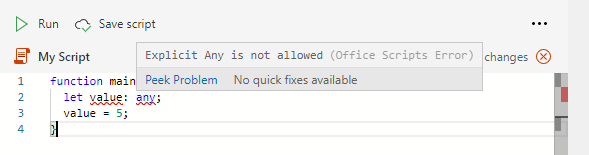

# Restrições de TypeScript em scripts do Office

Scripts do Office usam a linguagem TypeScript. Na maioria das partes, qualquer código TypeScript ou JavaScript funcionará em um Script do Office. No entanto, há algumas restrições impostas pelo Editor de Código para garantir que seu script funcione de forma consistente e conforme o esperado com a sua planilha do Excel.

## Nenhum tipo 'any' nos scripts do Office

Escrever [tipos](https://www.typescriptlang.org/docs/handbook/typescript-in-5-minutes.html) é opcional no TypeScript, porque os tipos podem ser adiados. No entanto, o Script do Office exige que uma variável não possa ser [do tipo qualquer.](https://www.typescriptlang.org/docs/handbook/basic-types.html#any) Tanto explícitas quanto `any` implícitas não são permitidas em um Script do Office. Esses casos são relatados como erros.

### Explícito `any`

Você não pode declarar explicitamente uma variável para ser do `any` tipo em Scripts do Office (ou seja, `let someVariable: any;` ). O `any` tipo causa problemas quando processado pelo Excel. Por exemplo, `Range` um precisa saber que um valor é um , ou `string` `number` `boolean` . Você receberá um erro em tempo de compilação (um erro antes de executar o script) se qualquer variável for explicitamente definida como o `any` tipo no script.

Na captura de tela acima `[5, 16] Explicit Any is not allowed` indica que a linha #5, coluna #16 define o `any` tipo. Isso ajuda a localizar o erro.

Para se livrar desse problema, defina sempre o tipo da variável. Se você não tiver certeza sobre o tipo de uma variável, poderá usar um tipo [de união.](https://www.typescriptlang.org/docs/handbook/unions-and-intersections.html) Isso pode ser útil para variáveis que têm valores, que podem ser do tipo , ou (o tipo de valores é `Range` `string` uma `number` `boolean` `Range` união desses: `string | number | boolean` ).

### Implícito `any`

Tipos de variável TypeScript podem ser [definidos implicitamente.](https://www.typescriptlang.org/docs/handbook/type-inference.html) Se o compilador typeScript não puder determinar o tipo de uma variável (porque o tipo não é definido explicitamente ou a inferência de tipo não é possível), então é um implícito e você receberá um erro de tempo de `any` compilação.

O caso mais comum em qualquer `any` implícito está em uma declaração de variável, como `let value;` . Há duas maneiras de evitar isso:

* Atribuir a variável a um tipo implicitamente identificável ( `let value = 5;` ou `let value = workbook.getWorksheet();` ).
* Digite explicitamente a variável ( `let value: number;` )

## Nenhuma interface ou classes de script do Office herdado

Classes e interfaces criadas no script do Office não podem estender ou [implementar](https://www.typescriptlang.org/docs/handbook/classes.html#inheritance) classes ou interfaces de Scripts do Office. Em outras palavras, nada no `ExcelScript` namespace pode ter subclasses ou subinterfaces.

## Funções TypeScript incompatíveis

As APIs de scripts do Office não podem ser usadas no seguinte:

* [Funções de gerador](https://developer.mozilla.org/docs/Web/JavaScript/Guide/Iterators_and_Generators#generator_functions)
* [Array.sort](https://developer.mozilla.org/docs/Web/JavaScript/Reference/Global_Objects/Array/sort)

## `eval` não é suportado

A função de [avaliação JavaScript](https://developer.mozilla.org/docs/Web/JavaScript/Reference/Global_Objects/eval) não é suportada por motivos de segurança.

## Identificadors restritos

As palavras a seguir não podem ser usadas como identificadores em um script. Eles são termos reservados.

* `Excel`
* `ExcelScript`
* `console`

## Avisos de desempenho

O [linter](https://wikipedia.org/wiki/Lint_(software)) do Editor de Código fornece avisos se o script pode ter problemas de desempenho. Os casos e como trabalhar em torno deles estão documentados em [Melhorar o desempenho dos scripts do Office.](web-client-performance.md)

## Chamadas de API externas

Confira [o suporte à chamada da API externa nos Scripts do Office](external-calls.md) para obter mais informações.

## Confira também

* [Fundamentos de script para scripts do Office no Excel na Web](scripting-fundamentals.md)
* [Melhorar o desempenho dos scripts do Office](web-client-performance.md)
