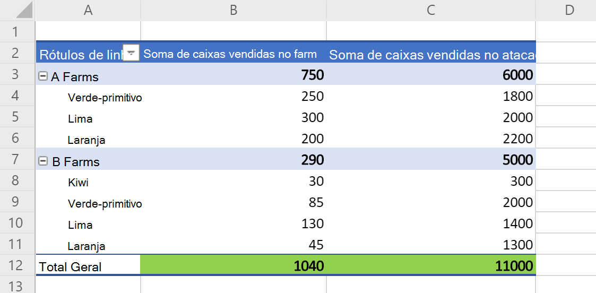

# <a name="basic-scripts-for-office-scripts-in-excel-on-the-web"></a><span data-ttu-id="50cee-103">Scripts básicos para scripts do Office no Excel na Web</span><span class="sxs-lookup"><span data-stu-id="50cee-103">Basic scripts for Office Scripts in Excel on the web</span></span>

<span data-ttu-id="50cee-104">Os exemplos a seguir são scripts simples para você experimentar suas próprias workbooks.</span><span class="sxs-lookup"><span data-stu-id="50cee-104">The following samples are simple scripts for you to try on your own workbooks.</span></span> <span data-ttu-id="50cee-105">Para usá-los no Excel na Web:</span><span class="sxs-lookup"><span data-stu-id="50cee-105">To use them in Excel on the web:</span></span>

1. <span data-ttu-id="50cee-106">Abra a guia **Automação**.</span><span class="sxs-lookup"><span data-stu-id="50cee-106">Open the **Automate** tab.</span></span>
2. <span data-ttu-id="50cee-107">Pressione **Editor de Código**.</span><span class="sxs-lookup"><span data-stu-id="50cee-107">Press **Code Editor**.</span></span>
3. <span data-ttu-id="50cee-108">Pressione **Novo Script** no painel de tarefas do Editor de Código.</span><span class="sxs-lookup"><span data-stu-id="50cee-108">Press **New Script** in the Code Editor's task pane.</span></span>
4. <span data-ttu-id="50cee-109">Substitua o script inteiro pelo exemplo de sua escolha.</span><span class="sxs-lookup"><span data-stu-id="50cee-109">Replace the entire script with the sample of your choice.</span></span>
5. <span data-ttu-id="50cee-110">Pressione **Executar** no painel de tarefas do Editor de Código.</span><span class="sxs-lookup"><span data-stu-id="50cee-110">Press **Run** in the Code Editor's task pane.</span></span>

## <a name="scripting-basics"></a><span data-ttu-id="50cee-111">Noções básicas de script</span><span class="sxs-lookup"><span data-stu-id="50cee-111">Scripting basics</span></span>

<span data-ttu-id="50cee-112">Esses exemplos demonstram blocos de construção fundamentais para scripts do Office.</span><span class="sxs-lookup"><span data-stu-id="50cee-112">These samples demonstrate fundamental building blocks for Office Scripts.</span></span> <span data-ttu-id="50cee-113">Adicione-os aos scripts para estender sua solução e resolver problemas comuns.</span><span class="sxs-lookup"><span data-stu-id="50cee-113">Add these to your scripts to extend your solution and solve common problems.</span></span>

### <a name="read-and-log-one-cell"></a><span data-ttu-id="50cee-114">Ler e registrar uma célula</span><span class="sxs-lookup"><span data-stu-id="50cee-114">Read and log one cell</span></span>

<span data-ttu-id="50cee-115">Este exemplo lê o valor **de A1** e o imprime no console.</span><span class="sxs-lookup"><span data-stu-id="50cee-115">This sample reads the value of **A1** and prints it to the console.</span></span>

```TypeScript
function main(workbook: ExcelScript.Workbook) {
  // Get the current worksheet.
  let selectedSheet = workbook.getActiveWorksheet();

  // Get the value of cell A1.
  let range = selectedSheet.getRange("A1");
  
  // Print the value of A1.
  console.log(range.getValue());
}
```

### <a name="read-the-active-cell"></a><span data-ttu-id="50cee-116">Ler a célula ativa</span><span class="sxs-lookup"><span data-stu-id="50cee-116">Read the active cell</span></span>

<span data-ttu-id="50cee-117">Esse script registra o valor da célula ativa atual.</span><span class="sxs-lookup"><span data-stu-id="50cee-117">This script logs the value of the current active cell.</span></span> <span data-ttu-id="50cee-118">Se várias células forem selecionadas, a célula mais à esquerda será registrada.</span><span class="sxs-lookup"><span data-stu-id="50cee-118">If multiple cells are selected, the top-leftmost cell will be logged.</span></span>

```TypeScript
function main(workbook: ExcelScript.Workbook) {
  // Get the current active cell in the workbook.
  let cell = workbook.getActiveCell();

  // Log that cell's value.
  console.log(`The current cell's value is ${cell.getValue()}`);
}
```

### <a name="change-an-adjacent-cell"></a><span data-ttu-id="50cee-119">Alterar uma célula adjacente</span><span class="sxs-lookup"><span data-stu-id="50cee-119">Change an adjacent cell</span></span>

<span data-ttu-id="50cee-120">Esse script obtém células adjacentes usando referências relativas.</span><span class="sxs-lookup"><span data-stu-id="50cee-120">This script gets adjacent cells using relative references.</span></span> <span data-ttu-id="50cee-121">Observe que, se a célula ativa estiver na linha superior, parte do script falhará, pois faz referência à célula acima da selecionada no momento.</span><span class="sxs-lookup"><span data-stu-id="50cee-121">Note that if the active cell is on the top row, part of the script fails, because it references the cell above the currently selected one.</span></span>

```TypeScript
function main(workbook: ExcelScript.Workbook) {
  // Get the currently active cell in the workbook.
  let activeCell = workbook.getActiveCell();
  console.log(`The active cell's address is: ${activeCell.getAddress()}`);

  // Get the cell to the right of the active cell and set its value and color.
  let rightCell = activeCell.getOffsetRange(0,1);
  rightCell.setValue("Right cell");
  console.log(`The right cell's address is: ${rightCell.getAddress()}`);
  rightCell.getFormat().getFont().setColor("Magenta");
  rightCell.getFormat().getFill().setColor("Cyan");

  // Get the cell to the above of the active cell and set its value and color.
  // Note that this operation will fail if the active cell is in the top row.
  let aboveCell = activeCell.getOffsetRange(-1, 0);
  aboveCell.setValue("Above cell");
  console.log(`The above cell's address is: ${aboveCell.getAddress()}`);
  aboveCell.getFormat().getFont().setColor("White");
  aboveCell.getFormat().getFill().setColor("Black");
}
```

### <a name="change-all-adjacent-cells"></a><span data-ttu-id="50cee-122">Alterar todas as células adjacentes</span><span class="sxs-lookup"><span data-stu-id="50cee-122">Change all adjacent cells</span></span>

<span data-ttu-id="50cee-123">Esse script copia a formatação na célula ativa para as células vizinhas.</span><span class="sxs-lookup"><span data-stu-id="50cee-123">This script copies the formatting in the active cell to the neighboring cells.</span></span> <span data-ttu-id="50cee-124">Observe que esse script só funciona quando a célula ativa não está na borda da planilha.</span><span class="sxs-lookup"><span data-stu-id="50cee-124">Note that this script only works when the active cell isn't on an edge of the worksheet.</span></span>

```TypeScript
function main(workbook: ExcelScript.Workbook) {
  // Get the active cell.
  let activeCell = workbook.getActiveCell();

  // Get the cell that's one row above and one column to the left of the active cell.
  let cornerCell = activeCell.getOffsetRange(-1,-1);

  // Get a range that includes all the cells surrounding the active cell.
  let surroundingRange = cornerCell.getResizedRange(2, 2)

  // Copy the formatting from the active cell to the new range.
  surroundingRange.copyFrom(
    activeCell, /* The source range. */
    ExcelScript.RangeCopyType.formats /* What to copy. */
    );
}
```

### <a name="change-each-individual-cell-in-a-range"></a><span data-ttu-id="50cee-125">Alterar cada célula individual em um intervalo</span><span class="sxs-lookup"><span data-stu-id="50cee-125">Change each individual cell in a range</span></span>

<span data-ttu-id="50cee-126">Esse script loops sobre o intervalo de seleção no momento.</span><span class="sxs-lookup"><span data-stu-id="50cee-126">This script loops over the currently select range.</span></span> <span data-ttu-id="50cee-127">Ele limpa a formatação atual e define a cor de preenchimento em cada célula como uma cor aleatória.</span><span class="sxs-lookup"><span data-stu-id="50cee-127">It clears the current formatting and sets the fill color in each cell to a random color.</span></span>

```TypeScript
function main(workbook: ExcelScript.Workbook) {
  // Get the currently selected range.
  let range = workbook.getSelectedRange();

  // Get the size boundaries of the range.
  let rows = range.getRowCount();
  let cols = range.getColumnCount();

  // Clear any existing formatting
  range.clear(ExcelScript.ClearApplyTo.formats);

  // Iterate over the range.
  for (let row = 0; row < rows; row++) {
    for (let col = 0; col < cols; col++) {
      // Generate a random color hex-code.
      let colorString = `#${Math.random().toString(16).substr(-6)}`;

      // Set the color of the current cell to that random hex-code.
      range.getCell(row, col).getFormat().getFill().setColor(colorString);
    }
  }
}
```

### <a name="get-groups-of-cells-based-on-special-criteria"></a><span data-ttu-id="50cee-128">Obter grupos de células com base em critérios especiais</span><span class="sxs-lookup"><span data-stu-id="50cee-128">Get groups of cells based on special criteria</span></span>

<span data-ttu-id="50cee-129">Esse script obtém todas as células em branco no intervalo usado da planilha atual.</span><span class="sxs-lookup"><span data-stu-id="50cee-129">This script gets all the blank cells in the current worksheet's used range.</span></span> <span data-ttu-id="50cee-130">Em seguida, realça todas as células com um plano de fundo amarelo.</span><span class="sxs-lookup"><span data-stu-id="50cee-130">It then highlights all those cells with a yellow background.</span></span>

```TypeScript
function main(workbook: ExcelScript.Workbook) {
    // Get the current used range.
    let range = workbook.getActiveWorksheet().getUsedRange();
    
    // Get all the blank cells.
    let blankCells = range.getSpecialCells(ExcelScript.SpecialCellType.blanks);

    // Highlight the blank cells with a yellow background.
    blankCells.getFormat().getFill().setColor("yellow");
}
```

## <a name="collections"></a><span data-ttu-id="50cee-131">Coleções</span><span class="sxs-lookup"><span data-stu-id="50cee-131">Collections</span></span>

<span data-ttu-id="50cee-132">Esses exemplos funcionam com coleções de objetos na workbook.</span><span class="sxs-lookup"><span data-stu-id="50cee-132">These samples work with collections of objects in the workbook.</span></span>

### <a name="iterating-over-collections"></a><span data-ttu-id="50cee-133">Iterating over collections</span><span class="sxs-lookup"><span data-stu-id="50cee-133">Iterating over collections</span></span>

<span data-ttu-id="50cee-134">Esse script obtém e registra os nomes de todas as planilhas na pasta de trabalho.</span><span class="sxs-lookup"><span data-stu-id="50cee-134">This script gets and logs the names of all the worksheets in the workbook.</span></span> <span data-ttu-id="50cee-135">Ele também define as cores da guia como uma cor aleatória.</span><span class="sxs-lookup"><span data-stu-id="50cee-135">It also sets the their tab colors to a random color.</span></span>

```TypeScript
function main(workbook: ExcelScript.Workbook) {
  // Get all the worksheets in the workbook.
  let sheets = workbook.getWorksheets();

  // Get a list of all the worksheet names.
  let names = sheets.map ((sheet) => sheet.getName());

  // Write in the console all the worksheet names and the total count.
  console.log(names);
  console.log(`Total worksheets inside of this workbook: ${sheets.length}`);
  
  // Set the tab color each worksheet to a random color
  for (let sheet of sheets) {
    // Generate a random color hex-code.
    let colorString = `#${Math.random().toString(16).substr(-6)}`;

    // Set the color of the current worksheet's tab to that random hex-code.
    sheet.setTabColor(colorString);
  }
}
```

### <a name="querying-and-deleting-from-a-collection"></a><span data-ttu-id="50cee-136">Consulta e exclusão de uma coleção</span><span class="sxs-lookup"><span data-stu-id="50cee-136">Querying and deleting from a collection</span></span>

<span data-ttu-id="50cee-137">Este script cria uma nova planilha.</span><span class="sxs-lookup"><span data-stu-id="50cee-137">This script creates a new worksheet.</span></span> <span data-ttu-id="50cee-138">Ele verifica uma cópia existente da planilha e a exclui antes de criar uma nova planilha.</span><span class="sxs-lookup"><span data-stu-id="50cee-138">It checks for an existing copy of the worksheet and deletes it before making a new sheet.</span></span>

```TypeScript
function main(workbook: ExcelScript.Workbook) {
  // Name of the worksheet to be added.
  let name = "Index";

  // Get any worksheet with that name.
  let sheet = workbook.getWorksheet("Index");
  
  // If `null` wasn't returned, then there's already a worksheet with that name.
  if (sheet) {
    console.log(`Worksheet by the name ${name} already exists. Deleting it.`);
    // Delete the sheet.
    sheet.delete();
  }
  
  // Add a blank worksheet with the name "Index".
  // Note that this code runs regardless of whether an existing sheet was deleted.
  console.log(`Adding the worksheet named ${name}.`);
  let newSheet = workbook.addWorksheet("Index");

  // Switch to the new worksheet.
  newSheet.activate();
}
```

## <a name="dates"></a><span data-ttu-id="50cee-139">Datas</span><span class="sxs-lookup"><span data-stu-id="50cee-139">Dates</span></span>

<span data-ttu-id="50cee-140">Os exemplos nesta seção mostram como usar o objeto Data de [JavaScript.](https://developer.mozilla.org/docs/web/javascript/reference/global_objects/date)</span><span class="sxs-lookup"><span data-stu-id="50cee-140">The samples in this section show how to use the JavaScript [Date](https://developer.mozilla.org/docs/web/javascript/reference/global_objects/date) object.</span></span>

<span data-ttu-id="50cee-141">O exemplo a seguir obtém a data e a hora atuais e grava esses valores em duas células na planilha ativa.</span><span class="sxs-lookup"><span data-stu-id="50cee-141">The following sample gets the current date and time and then writes those values to two cells in the active worksheet.</span></span>

```TypeScript
function main(workbook: ExcelScript.Workbook) {
  // Get the cells at A1 and B1.
  let dateRange = workbook.getActiveWorksheet().getRange("A1");
  let timeRange = workbook.getActiveWorksheet().getRange("B1");

  // Get the current date and time with the JavaScript Date object.
  let date = new Date(Date.now());

  // Add the date string to A1.
  dateRange.setValue(date.toLocaleDateString());

  // Add the time string to B1.
  timeRange.setValue(date.toLocaleTimeString());
}
```

<span data-ttu-id="50cee-142">O próximo exemplo lê uma data armazenada no Excel e a converte em um objeto Data JavaScript.</span><span class="sxs-lookup"><span data-stu-id="50cee-142">The next sample reads a date that's stored in Excel and translates it to a JavaScript Date object.</span></span> <span data-ttu-id="50cee-143">Ele usa o [número de série](https://support.office.com/article/now-function-3337fd29-145a-4347-b2e6-20c904739c46) numérico da data como entrada para a Data JavaScript.</span><span class="sxs-lookup"><span data-stu-id="50cee-143">It uses the [date's numeric serial number](https://support.office.com/article/now-function-3337fd29-145a-4347-b2e6-20c904739c46) as input for the JavaScript Date.</span></span>

```TypeScript
function main(workbook: ExcelScript.Workbook) {
  // Read a date at cell A1 from Excel.
  let dateRange = workbook.getActiveWorksheet().getRange("A1");

  // Convert the Excel date to a JavaScript Date object.
  let excelDateValue = dateRange.getValue() as number;
  let javaScriptDate = new Date(Math.round((excelDateValue - 25569) * 86400 * 1000));
  console.log(javaScriptDate);
}
```

## <a name="display-data"></a><span data-ttu-id="50cee-144">Exibir dados</span><span class="sxs-lookup"><span data-stu-id="50cee-144">Display data</span></span>

<span data-ttu-id="50cee-145">Esses exemplos demonstram como trabalhar com dados de planilha e fornecer aos usuários uma melhor exibição ou organização.</span><span class="sxs-lookup"><span data-stu-id="50cee-145">These samples demonstrate how to work with worksheet data and provide users with a better view or organization.</span></span>

### <a name="apply-conditional-formatting"></a><span data-ttu-id="50cee-146">Aplicar formatação condicional</span><span class="sxs-lookup"><span data-stu-id="50cee-146">Apply conditional formatting</span></span>

<span data-ttu-id="50cee-147">Este exemplo aplica formatação condicional ao intervalo usado atualmente na planilha.</span><span class="sxs-lookup"><span data-stu-id="50cee-147">This sample applies conditional formatting to the currently used range in the worksheet.</span></span> <span data-ttu-id="50cee-148">A formatação condicional é um preenchimento verde para os 10% principais dos valores.</span><span class="sxs-lookup"><span data-stu-id="50cee-148">The conditional formatting is a green fill for the top 10% of values.</span></span>

```TypeScript
function main(workbook: ExcelScript.Workbook) {
  // Get the current worksheet.
  let selectedSheet = workbook.getActiveWorksheet();

  // Get the used range in the worksheet.
  let range = selectedSheet.getUsedRange();

  // Set the fill color to green for the top 10% of values in the range.
  let conditionalFormat = range.addConditionalFormat(ExcelScript.ConditionalFormatType.topBottom)
  conditionalFormat.getTopBottom().getFormat().getFill().setColor("green");
  conditionalFormat.getTopBottom().setRule({
    rank: 10, // The percentage threshold.
    type: ExcelScript.ConditionalTopBottomCriterionType.topPercent // The type of the top/bottom condition.
  });
}
```

### <a name="create-a-sorted-table"></a><span data-ttu-id="50cee-149">Criar uma tabela classificação</span><span class="sxs-lookup"><span data-stu-id="50cee-149">Create a sorted table</span></span>

<span data-ttu-id="50cee-150">Este exemplo cria uma tabela do intervalo usado da planilha atual e classifica-a com base na primeira coluna.</span><span class="sxs-lookup"><span data-stu-id="50cee-150">This sample creates a table from the current worksheet's used range, then sorts it based on the first column.</span></span>

```TypeScript
function main(workbook: ExcelScript.Workbook) {
  // Get the current worksheet.
  let selectedSheet = workbook.getActiveWorksheet();

  // Create a table with the used cells.
  let usedRange = selectedSheet.getUsedRange();
  let newTable = selectedSheet.addTable(usedRange, true);

  // Sort the table using the first column.
  newTable.getSort().apply([{ key: 0, ascending: true }]);
}
```

### <a name="log-the-grand-total-values-from-a-pivottable"></a><span data-ttu-id="50cee-151">Registrar os valores "Grande Total" de uma tabela dinâmica</span><span class="sxs-lookup"><span data-stu-id="50cee-151">Log the "Grand Total" values from a PivotTable</span></span>

<span data-ttu-id="50cee-152">Este exemplo localiza a primeira Tabela Dinâmica na lista de trabalho e registra os valores nas células "Grand Total" (conforme realçado em verde na imagem abaixo).</span><span class="sxs-lookup"><span data-stu-id="50cee-152">This sample finds the first PivotTable in the workbook and logs the values in the "Grand Total" cells (as highlighted in green in the image below).</span></span>



```TypeScript
function main(workbook: ExcelScript.Workbook) {
  // Get the first PivotTable in the workbook.
  let pivotTable = workbook.getPivotTables()[0];

  // Get the names of each data column in the PivotTable.
  let pivotColumnLabelRange = pivotTable.getLayout().getColumnLabelRange();

  // Get the range displaying the pivoted data.
  let pivotDataRange = pivotTable.getLayout().getBodyAndTotalRange();

  // Get the range with the "grand totals" for the PivotTable columns.
  let grandTotalRange = pivotDataRange.getLastRow();

  // Print each of the "Grand Totals" to the console.
  grandTotalRange.getValues()[0].forEach((column, columnIndex) => {
    console.log(`Grand total of ${pivotColumnLabelRange.getValues()[0][columnIndex]}: ${grandTotalRange.getValues()[0][columnIndex]}`);
    // Example log: "Grand total of Sum of Crates Sold Wholesale: 11000"
  });
}
```

### <a name="use-data-validation-to-create-a-drop-down-list"></a><span data-ttu-id="50cee-154">Usar validação de dados para criar uma lista lista listada</span><span class="sxs-lookup"><span data-stu-id="50cee-154">Use data validation to create a drop-down list</span></span>

<span data-ttu-id="50cee-155">Esse script cria uma lista de seleção listada para uma célula.</span><span class="sxs-lookup"><span data-stu-id="50cee-155">This script creates a drop-down selection list for a cell.</span></span> <span data-ttu-id="50cee-156">Ele usa os valores existentes do intervalo selecionado como as opções da lista.</span><span class="sxs-lookup"><span data-stu-id="50cee-156">It uses the existing values of the selected range as the choices for the list.</span></span>


```TypeScript
function main(workbook: ExcelScript.Workbook) {
  // Get the values for data validation.
  let selectedRange = workbook.getSelectedRange();
  let rangeValues = selectedRange.getValues();

  // Convert the values into a comma-delimited string.
  let dataValidationListString = "";
  rangeValues.forEach((rangeValueRow) => {
    rangeValueRow.forEach((value) => {
      dataValidationListString += value + ",";
    });
  });

  // Clear the old range.
  selectedRange.clear(ExcelScript.ClearApplyTo.contents);

  // Apply the data validation to the first cell in the selected range.
  let targetCell = selectedRange.getCell(0,0);
  let dataValidation = targetCell.getDataValidation();

  // Set the content of the drop-down list.
  dataValidation.setRule({
      list: {
        inCellDropDown: true,
        source: dataValidationListString
      }
    });
}
```

## <a name="formulas"></a><span data-ttu-id="50cee-158">Fórmulas</span><span class="sxs-lookup"><span data-stu-id="50cee-158">Formulas</span></span>

<span data-ttu-id="50cee-159">Esses exemplos usam fórmulas do Excel e mostram como trabalhar com elas em scripts.</span><span class="sxs-lookup"><span data-stu-id="50cee-159">These samples use Excel formulas and show how to work with them in scripts.</span></span>

### <a name="single-formula"></a><span data-ttu-id="50cee-160">Fórmula única</span><span class="sxs-lookup"><span data-stu-id="50cee-160">Single formula</span></span>

<span data-ttu-id="50cee-161">Esse script define a fórmula de uma célula e exibe como o Excel armazena a fórmula e o valor da célula separadamente.</span><span class="sxs-lookup"><span data-stu-id="50cee-161">This script sets a cell's formula, then displays how Excel stores the cell's formula and value separately.</span></span>

```TypeScript
function main(workbook: ExcelScript.Workbook) {
  let selectedSheet = workbook.getActiveWorksheet();

  // Set A1 to 2.
  let a1 = selectedSheet.getRange("A1");
  a1.setValue(2);

  // Set B1 to the formula =(2*A1), which should equal 4.
  let b1 = selectedSheet.getRange("B1")
  b1.setFormula("=(2*A1)");

  // Log the current results for `getFormula` and `getValue` at B1.
  console.log(`B1 - Formula: ${b1.getFormula()} | Value: ${b1.getValue()}`);
}
```

### <a name="spilling-results-from-a-formula"></a><span data-ttu-id="50cee-162">Vazamento de resultados de uma fórmula</span><span class="sxs-lookup"><span data-stu-id="50cee-162">Spilling results from a formula</span></span>

<span data-ttu-id="50cee-163">Esse script transpõe o intervalo "A1:D2" para "A4:B7" usando a função TRANSPOSE.</span><span class="sxs-lookup"><span data-stu-id="50cee-163">This script transposes the range "A1:D2" to "A4:B7" by using the TRANSPOSE function.</span></span> <span data-ttu-id="50cee-164">Se a transposição resulta em um erro #SPILL, limpa o intervalo de destino e aplica a fórmula novamente.</span><span class="sxs-lookup"><span data-stu-id="50cee-164">If the transpose results in a #SPILL error, it clears the target range and applies the formula again.</span></span>

```TypeScript
function main(workbook: ExcelScript.Workbook) {
  let sheet = workbook.getActiveWorksheet();
  // Use the data in A1:D2 for the sample.
  let dataAddress = "A1:D2"
  let inputRange = sheet.getRange(dataAddress);

  // Place the transposed data starting at A4.
  let targetStartCell = sheet.getRange("A4");

  // Compute the target range.
  let targetRange = targetStartCell.getResizedRange(inputRange.getColumnCount() - 1, inputRange.getRowCount() - 1);

  // Call the transpose helper function.
  targetStartCell.setFormula(`=TRANSPOSE(${dataAddress})`);

  // Check if the range update resulted in a spill error.
  let checkValue = targetStartCell.getValue() as string;
  if (checkValue === '#SPILL!') {
    // Clear the target range and call the transpose function again.
    console.log("Target range has data that is preventing update. Clearing target range.");
    targetRange.clear();
    targetStartCell.setFormula(`=TRANSPOSE(${dataAddress})`);
  }

  // Select the transposed range to highlight it.
  targetRange.select();
}
```

## <a name="suggest-new-samples"></a><span data-ttu-id="50cee-165">Sugerir novos exemplos</span><span class="sxs-lookup"><span data-stu-id="50cee-165">Suggest new samples</span></span>

<span data-ttu-id="50cee-166">Recebemos sugestões de novos exemplos.</span><span class="sxs-lookup"><span data-stu-id="50cee-166">We welcome suggestions for new samples.</span></span> <span data-ttu-id="50cee-167">Se houver um cenário comum que ajude outros desenvolvedores de scripts, conte-nos na seção comentários abaixo.</span><span class="sxs-lookup"><span data-stu-id="50cee-167">If there is a common scenario that would help other script developers, please tell us in the feedback section below.</span></span>
