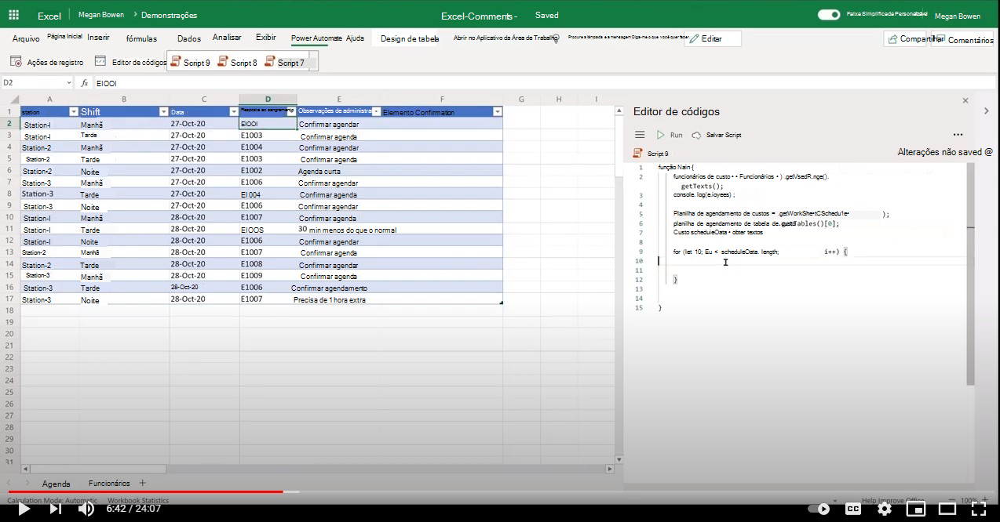

# <a name="add-comments-in-excel"></a><span data-ttu-id="764a0-103">Adicionar comentários no Excel</span><span class="sxs-lookup"><span data-stu-id="764a0-103">Add comments in Excel</span></span>

<span data-ttu-id="764a0-104">Este exemplo mostra como adicionar comentários a uma célula, [incluindo @mentioning](https://support.microsoft.com/office/90701709-5dc1-41c7-aa48-b01d4a46e8c7) um colega.</span><span class="sxs-lookup"><span data-stu-id="764a0-104">This sample shows how to add comments to a cell including [@mentioning](https://support.microsoft.com/office/90701709-5dc1-41c7-aa48-b01d4a46e8c7) a colleague.</span></span>

## <a name="example-scenario"></a><span data-ttu-id="764a0-105">Cenário de exemplo</span><span class="sxs-lookup"><span data-stu-id="764a0-105">Example scenario</span></span>

* <span data-ttu-id="764a0-106">O líder da equipe mantém o cronograma de turnos.</span><span class="sxs-lookup"><span data-stu-id="764a0-106">The team lead maintains the shift schedule.</span></span> <span data-ttu-id="764a0-107">O líder da equipe atribui uma ID de funcionário ao registro de turno.</span><span class="sxs-lookup"><span data-stu-id="764a0-107">The team lead assigns an employee ID to the shift record.</span></span>
* <span data-ttu-id="764a0-108">O líder da equipe deseja notificar o funcionário.</span><span class="sxs-lookup"><span data-stu-id="764a0-108">The team lead wishes to notify the employee.</span></span> <span data-ttu-id="764a0-109">Adicionando um comentário que @mentions o funcionário, o funcionário é enviado por email com uma mensagem personalizada da planilha.</span><span class="sxs-lookup"><span data-stu-id="764a0-109">By adding a comment that @mentions the employee, the employee is emailed with a custom message from the worksheet.</span></span>
* <span data-ttu-id="764a0-110">Posteriormente, o funcionário pode exibir a guia de trabalho e responder ao comentário por conveniência.</span><span class="sxs-lookup"><span data-stu-id="764a0-110">Subsequently, the employee can view the workbook and respond to the comment at their convenience.</span></span>

## <a name="solution"></a><span data-ttu-id="764a0-111">Solução</span><span class="sxs-lookup"><span data-stu-id="764a0-111">Solution</span></span>

1. <span data-ttu-id="764a0-112">O script extrai informações dos funcionários da planilha do funcionário.</span><span class="sxs-lookup"><span data-stu-id="764a0-112">The script extracts employee information from the employee worksheet.</span></span>
1. <span data-ttu-id="764a0-113">Em seguida, o script adiciona um comentário (incluindo o email de funcionário relevante) à célula apropriada no registro de turno.</span><span class="sxs-lookup"><span data-stu-id="764a0-113">The script then adds a comment (including the relevant employee email) to the appropriate cell in the shift record.</span></span>
1. <span data-ttu-id="764a0-114">Os comentários existentes na célula são removidos antes de adicionar o novo comentário.</span><span class="sxs-lookup"><span data-stu-id="764a0-114">Existing comments in the cell are removed before adding the new comment.</span></span>

## <a name="sample-code-add-comments"></a><span data-ttu-id="764a0-115">Código de exemplo: Adicionar comentários</span><span class="sxs-lookup"><span data-stu-id="764a0-115">Sample code: Add comments</span></span>

<span data-ttu-id="764a0-116">Baixe o arquivo <a href="excel-comments.xlsx">excel-comments.xlsx</a> usado neste exemplo e experimente você mesmo!</span><span class="sxs-lookup"><span data-stu-id="764a0-116">Download the file <a href="excel-comments.xlsx">excel-comments.xlsx</a> used in this sample and try it out yourself!</span></span>

```TypeScript
function main(workbook: ExcelScript.Workbook) {
    const employees = workbook.getWorksheet('Employees').getUsedRange().getTexts();
    console.log(employees); 

    const scheduleSheet = workbook.getWorksheet('Schedule');
    const table = scheduleSheet.getTables()[0];
    const range = table.getRangeBetweenHeaderAndTotal();
    const scheduleData = range.getTexts();

    for (let i=0; i < scheduleData.length; i++) {
      let eId = scheduleData[i][3];

      let employeeInfo = employees.find(e => e[0] === eId);
      if (employeeInfo) {
        console.log("Found a match " + employeeInfo);
        let adminNotes = scheduleData[i][4];
        try { 
          let comment = workbook.getCommentByCell(range.getCell(i, 5));
          comment.delete();
        } catch {
            console.log("Ignore if there is no existing comment in the cell");
        }
        workbook.addComment(range.getCell(i,5), {
          mentions: [{
            email: employeeInfo[1],
            id: 0,
            name: employeeInfo[2]
          }],
          richContent: `<at id=\"0\">${employeeInfo[2]}</at> ${adminNotes}`
        }, ExcelScript.ContentType.mention);        
        
      } else {
        console.log("No match for: " + eId);
      }
    }
    return;
}
```

## <a name="training-video-add-comments"></a><span data-ttu-id="764a0-117">Vídeo de treinamento: Adicionar comentários</span><span class="sxs-lookup"><span data-stu-id="764a0-117">Training video: Add comments</span></span>

<span data-ttu-id="764a0-118">[](https://youtu.be/CpR78nkaOFw "Vídeo passo a passo sobre como adicionar comentários em um arquivo do Excel")</span><span class="sxs-lookup"><span data-stu-id="764a0-118">[](https://youtu.be/CpR78nkaOFw "Step-by-step video on how to add comments in an Excel file")</span></span>
