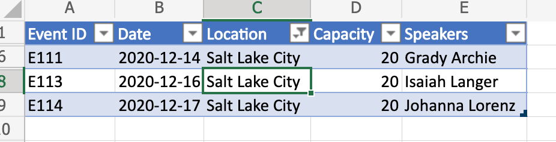

# <a name="clear-table-column-filter-based-on-active-cell-location"></a>Limpar filtro de coluna de tabela com base no local ativo da célula

Este exemplo limpa o filtro de coluna de tabela com base no local da célula ativa. O script detecta se a célula faz parte de uma tabela, determina a coluna da tabela e limpa qualquer filtro aplicado a ela.

Se você quiser saber mais sobre como salvar o filtro antes de desmatá-lo (e reaplicação posterior), consulte Mover linhas entre tabelas salvando [filtros](move-rows-across-tables.md), um exemplo mais avançado.

_Antes de limpar o filtro de coluna (observe a célula ativa)_



_Depois de limpar o filtro de coluna_


## <a name="sample-code-clear-table-column-filter-based-on-active-cell"></a>Código de exemplo: Limpar filtro de coluna de tabela com base na célula ativa

O script a seguir limpa o filtro de coluna de tabela com base no local da célula ativa e pode ser aplicado a qualquer arquivo do Excel com uma tabela. Por conveniência, você pode baixar e usar <a href="table-with-filter.xlsx">table-with-filter.xlsx</a>.

```TypeScript
function main(workbook: ExcelScript.Workbook) {
    // Get active cell.
    const cell = workbook.getActiveCell();

    // Get all tables associated with that cell.
    const tables = cell.getTables();
    
    // If there is no table on the selection, return/exit.
    if (tables.length !== 1) {
      console.log("The selection is not in a table.");
      return;
    }

    // Get table (since it is already determined that there is only
    // a single table part of the selection).
    const currentTable = tables[0];

    console.log(currentTable.getName());
    console.log(currentTable.getRange().getAddress());

    const entireCol = cell.getEntireColumn();
    const intersect = entireCol.getIntersection(currentTable.getRange());
    console.log(intersect.getAddress());

    const headerCellValue = intersect.getCell(0,0).getValue() as string;
    console.log(headerCellValue);

    // Get column.
    const col = currentTable.getColumnByName(headerCellValue);

    // Clear filter.
    col.getFilter().clear();
}
```

## <a name="training-video-clear-table-column-filter-based-on-active-cell-location"></a>Vídeo de treinamento: Limpar filtro de coluna de tabela com base no local ativo da célula

Para ver um exemplo de como trabalhar com intervalos, consulte [Range basics training videos](range-basics.md#training-videos-range-basics).
