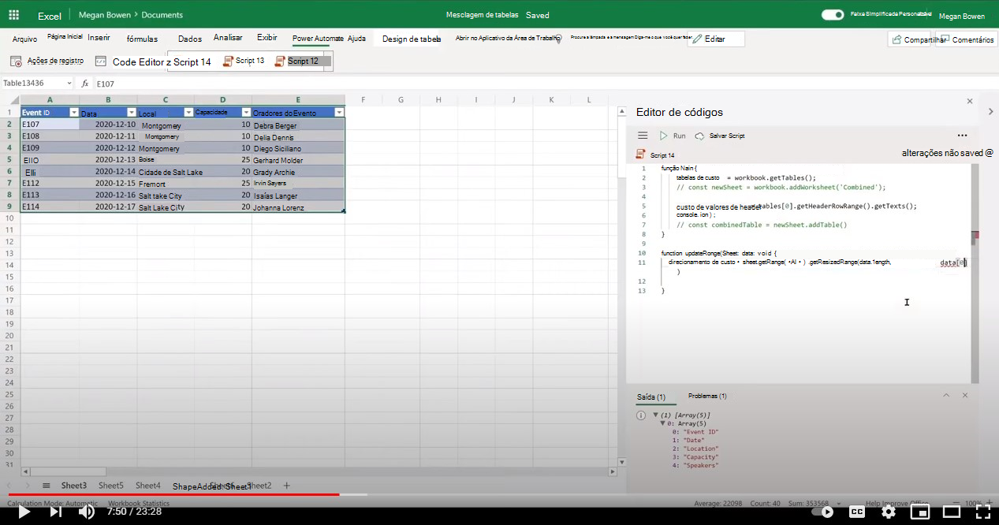

# <a name="combine-data-from-multiple-excel-tables-into-a-single-table"></a><span data-ttu-id="3ab76-103">Combinar dados de várias tabelas do Excel em uma única tabela</span><span class="sxs-lookup"><span data-stu-id="3ab76-103">Combine data from multiple Excel tables into a single table</span></span>

<span data-ttu-id="3ab76-104">Este exemplo combina dados de várias tabelas do Excel em uma única tabela que inclui todas as linhas.</span><span class="sxs-lookup"><span data-stu-id="3ab76-104">This sample combines data from multiple Excel tables into a single table that includes all the rows.</span></span> <span data-ttu-id="3ab76-105">Supõe que todas as tabelas que estão sendo usadas tenham a mesma estrutura.</span><span class="sxs-lookup"><span data-stu-id="3ab76-105">It assumes that all tables being used have the same structure.</span></span>

<span data-ttu-id="3ab76-106">Há duas variações deste script:</span><span class="sxs-lookup"><span data-stu-id="3ab76-106">There are two variations of this script:</span></span>

1. <span data-ttu-id="3ab76-107">O [primeiro script](#sample-code-combine-data-from-multiple-excel-tables-into-a-single-table) combina todas as tabelas no arquivo do Excel.</span><span class="sxs-lookup"><span data-stu-id="3ab76-107">The [first script](#sample-code-combine-data-from-multiple-excel-tables-into-a-single-table) combines all tables in the Excel file.</span></span>
1. <span data-ttu-id="3ab76-108">O [segundo script](#sample-code-combine-data-from-multiple-excel-tables-in-select-worksheets-into-a-single-table) obtém tabelas seletivamente em um conjunto de planilhas.</span><span class="sxs-lookup"><span data-stu-id="3ab76-108">The [second script](#sample-code-combine-data-from-multiple-excel-tables-in-select-worksheets-into-a-single-table) selectively gets tables within a set of worksheets.</span></span>

## <a name="sample-code-combine-data-from-multiple-excel-tables-into-a-single-table"></a><span data-ttu-id="3ab76-109">Código de exemplo: combinar dados de várias tabelas do Excel em uma única tabela</span><span class="sxs-lookup"><span data-stu-id="3ab76-109">Sample code: Combine data from multiple Excel tables into a single table</span></span>

<span data-ttu-id="3ab76-110">Baixe o arquivo de <a href="tables-copy.xlsx"> exemplotables-copy.xlsx</a> e use-o com o script a seguir para experimentar você mesmo!</span><span class="sxs-lookup"><span data-stu-id="3ab76-110">Download the sample file <a href="tables-copy.xlsx">tables-copy.xlsx</a> and use it with the following script to try it out yourself!</span></span>

```TypeScript
function main(workbook: ExcelScript.Workbook) {
    workbook.getWorksheet('Combined')?.delete();
    const newSheet = workbook.addWorksheet('Combined');
    
    const tables = workbook.getTables();    
    const headerValues = tables[0].getHeaderRowRange().getTexts();
    console.log(headerValues);
    const targetRange = updateRange(newSheet, headerValues);
    const combinedTable = newSheet.addTable(targetRange.getAddress(), true);
    for (let table of tables) {      
      let dataValues = table.getRangeBetweenHeaderAndTotal().getTexts();
      let rowCount = table.getRowCount();
      if (rowCount > 0) {
        combinedTable.addRows(-1, dataValues);
      }
    }
}

function updateRange(sheet: ExcelScript.Worksheet, data: string[][]): ExcelScript.Range {
  const targetRange = sheet.getRange('A1').getResizedRange(data.length-1, data[0].length-1);
  targetRange.setValues(data);
  return targetRange;
}
```

## <a name="sample-code-combine-data-from-multiple-excel-tables-in-select-worksheets-into-a-single-table"></a><span data-ttu-id="3ab76-111">Código de exemplo: Combinar dados de várias tabelas do Excel em planilhas selecionadas em uma única tabela</span><span class="sxs-lookup"><span data-stu-id="3ab76-111">Sample code: Combine data from multiple Excel tables in select worksheets into a single table</span></span>

<span data-ttu-id="3ab76-112">Baixe o arquivo de <a href="tables-select-copy.xlsx"> exemplotables-select-copy.xlsx</a> e use-o com o script a seguir para experimentar você mesmo!</span><span class="sxs-lookup"><span data-stu-id="3ab76-112">Download the sample file <a href="tables-select-copy.xlsx">tables-select-copy.xlsx</a> and use it with the following script to try it out yourself!</span></span>

```TypeScript
function main(workbook: ExcelScript.Workbook) {
    const sheetNames = ['Sheet1', 'Sheet2', 'Sheet3'];
    
    workbook.getWorksheet('Combined')?.delete();
    const newSheet = workbook.addWorksheet('Combined');
    let targetTableCreated = false;
    let combinedTable;
    sheetNames.forEach((sheet) => {
      const tables = workbook.getWorksheet(sheet).getTables();
      if (!targetTableCreated) {
        const headerValues = tables[0].getHeaderRowRange().getTexts();
        const targetRange = updateRange(newSheet, headerValues);
        combinedTable = newSheet.addTable(targetRange.getAddress(), true);
        targetTableCreated = true;
      }      
      for (let table of tables) {
        let dataValues = table.getRangeBetweenHeaderAndTotal().getTexts();
        let rowCount = table.getRowCount();
        if (rowCount > 0) {
        combinedTable.addRows(-1, dataValues);
        }
      }
    })
}

function updateRange(sheet: ExcelScript.Worksheet, data: string[][]): ExcelScript.Range {
  const targetRange = sheet.getRange('A1').getResizedRange(data.length-1, data[0].length-1);
  targetRange.setValues(data);
  return targetRange;
}
```

## <a name="training-video-combine-data-from-multiple-excel-tables-into-a-single-table"></a><span data-ttu-id="3ab76-113">Vídeo de treinamento: combinar dados de várias tabelas do Excel em uma única tabela</span><span class="sxs-lookup"><span data-stu-id="3ab76-113">Training video: Combine data from multiple Excel tables into a single table</span></span>

<span data-ttu-id="3ab76-114">[](https://youtu.be/di-8JukK3Lc "Vídeo passo a passo sobre como combinar dados de várias tabelas do Excel em uma única tabela")</span><span class="sxs-lookup"><span data-stu-id="3ab76-114">[](https://youtu.be/di-8JukK3Lc "Step-by-step video on how to combine data from multiple Excel tables into a single table")</span></span>
