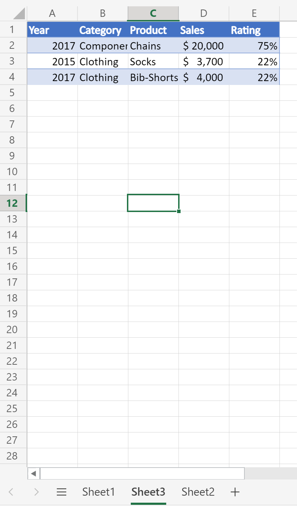

# <a name="count-blank-rows-on-sheets"></a>Contar linhas em branco em planilhas

Este projeto inclui dois scripts:

* [Contar linhas em branco em uma determinada planilha:](#sample-code-count-blank-rows-on-a-given-sheet)percorre o intervalo usado em uma determinada planilha e retorna uma contagem de linhas em branco.
* [Contar linhas em branco em todas as planilhas](#sample-code-count-blank-rows-on-all-sheets): percorre o intervalo usado em todas as _planilhas_ e retorna uma contagem de linhas em branco.

> [!NOTE]
> Para nosso script, uma linha em branco é qualquer linha onde não há dados. A linha pode ter formatação.

_Esta planilha retorna a contagem de 4 linhas em branco_


_Esta planilha retorna a contagem de 0 linhas em branco (todas as linhas têm alguns dados)_



## <a name="sample-code-count-blank-rows-on-a-given-sheet"></a>Código de exemplo: Contar linhas em branco em uma determinada planilha

```TypeScript
function main(workbook: ExcelScript.Workbook): number
{
  const sheet = workbook.getWorksheet('Sheet1'); 
  // Getting the active worksheet is not suitable for a script used by Power Automate.
  // const sheet = workbook.getActiveWorksheet();
  
  const range = sheet.getUsedRange(true); // Get value only.
  if (!range) {
    console.log(`No data on this sheet. `);
    return;
  }
  console.log(`Used range for the worksheet: ${range.getAddress()}`);
  const values = range.getValues();
  let emptyRows = 0;
  for (let row of values) {
    let len = 0; 
    for (let cell of row) {
      len = len + cell.toString().length;
    }
    if (len === 0) { 
      emptyRows++;
    }
  }
  console.log(`Total empty row: ` + emptyRows);
  return emptyRows;
}
```

## <a name="sample-code-count-blank-rows-on-all-sheets"></a>Código de exemplo: Contar linhas em branco em todas as planilhas

```TypeScript
function main(workbook: ExcelScript.Workbook): number
{
  const sheets = workbook.getWorksheets();
  let emptyRows = 0;
  for (let sheet of sheets) { 
    const range = sheet.getUsedRange(true); // Get value only.
    if (!range) {
      console.log(`No data on this sheet. `);
      continue;
    }
    console.log(`Used range for the worksheet ${sheet.getName()}: ${range.getAddress()}`);
    const values = range.getValues();

    for (let row of values) {
      let len = 0;
      for (let cell of row) {
        len = len + cell.toString().length;
      }
      if (len === 0) {
        emptyRows++;
      }
    }
  }
  console.log(`Total empty row: ` + emptyRows);
  return emptyRows;
}
```

## <a name="use-with-power-automate"></a>Usar com o Power Automate


