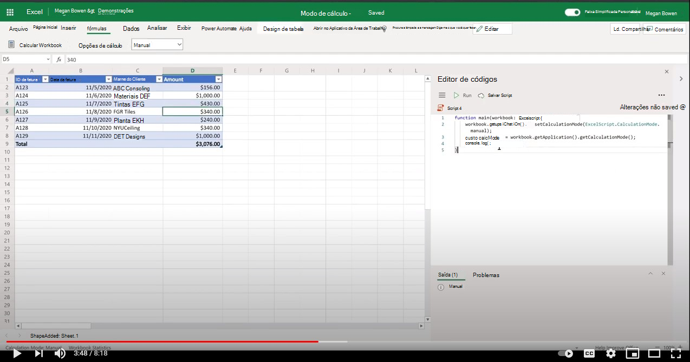

# <a name="manage-calculation-mode-in-excel"></a>Gerenciar o modo de cálculo no Excel

Este exemplo mostra como usar o modo [de cálculo](/javascript/api/office-scripts/excelscript/excelscript.calculationmode) e calcular métodos no Excel na Web usando Scripts do Office. Você pode experimentar o script em qualquer arquivo do Excel.

## <a name="scenario"></a>Cenário

No Excel na Web, o modo de cálculo de um arquivo pode ser controlado programaticamente usando APIs. As ações a seguir são possíveis usando Scripts do Office.

1. Obter o modo de cálculo.
1. De definir o modo de cálculo.
1. Calcule fórmulas do Excel para arquivos que são definidos para o modo manual (também chamado de recálcula).

## <a name="sample-code-control-calculation-mode"></a>Código de exemplo: Modo de cálculo de controle

```TypeScript
function main(workbook: ExcelScript.Workbook) {
    // Set calculation mode.
    workbook.getApplication().setCalculationMode(ExcelScript.CalculationMode.manual);
    // Get calculation mode.
    const calcMode = workbook.getApplication().getCalculationMode();    
    console.log(calcMode);
    // Calculate (for manual mode files).
    workbook.getApplication().calculate(ExcelScript.CalculationType.full);
}
```

## <a name="training-video-manage-calculation-mode"></a>Vídeo de treinamento: Gerenciar o modo de cálculo

[](https://youtu.be/iw6O8QH01CI "Vídeo passo a passo sobre como gerenciar o modo de cálculo no Excel na Web")
