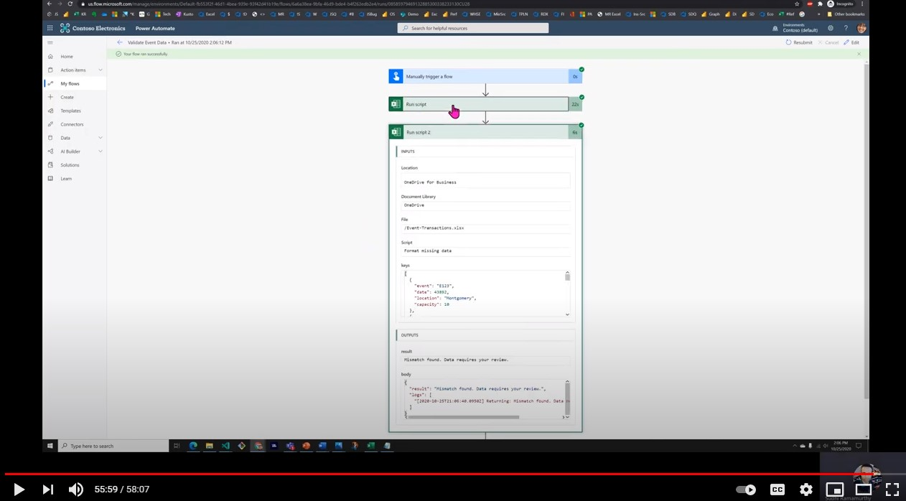

# <a name="cross-reference-and-format-an-excel-file"></a>Referência cruzada e formatar um arquivo do Excel

Esta solução mostra como dois arquivos do Excel podem ser cruzados e formatados usando Scripts do Office e Power Automate.

O projeto atinge o seguinte:

1. Extrai dados de eventos de <a href="events.xlsx">events.xlsx</a> usando uma ação executar script.
1. Passa esses dados para o segundo arquivo do Excel que contém dados de transação de evento e usa esses dados para fazer validação básica de dados e formatação de dados ausentes ou incorretos usando Scripts do Office.
1. Envia o resultado para um revistor por email.

Para obter mais detalhes, consulte [Referência Cruzada e formatação de dois arquivos do Excel usando Scripts do Office.](https://powerusers.microsoft.com/t5/Power-Automate-Cookbook/Cross-Reference-and-formatting-two-Excel-files-using-Office/td-p/728535)

## <a name="sample-excel-files"></a>Exemplo de arquivos do Excel

Baixe os seguintes arquivos usados nesta solução para experimentar você mesmo!

1. <a href="events.xlsx">events.xlsx</a>
1. <a href="event-transactions.xlsx">event-transactions.xlsx</a>

## <a name="sample-code-get-event-data"></a>Código de exemplo: Obter dados de evento

```TypeScript
function main(workbook: ExcelScript.Workbook): EventData[] {
    let table = workbook.getWorksheet('Keys').getTables()[0];
    let range = table.getRangeBetweenHeaderAndTotal();
    let rows = range.getValues();
    let records: EventData[] = [];
    for (let row of rows) {
        let [event, date, location, capacity] = row;
        records.push({
            event: event as string,
            date: date as number, 
            location: location as string,
            capacity: capacity as number
        })
    }
    console.log(JSON.stringify(records))
    return records;
}

interface EventData {
    event: string
    date: number
    location: string
    capacity: number
}
```

## <a name="sample-code-validate-event-transactions"></a>Código de exemplo: Validar transações de evento

```TypeScript
function main(workbook: ExcelScript.Workbook, keys: string): string {
    let table = workbook.getWorksheet('Transactions').getTables()[0];
    let range = table.getRangeBetweenHeaderAndTotal();
    range.clear(ExcelScript.ClearApplyTo.formats);
  
    let overallMatch = true;
  
    table.getColumnByName('Date').getRangeBetweenHeaderAndTotal().setNumberFormatLocal("yyyy-mm-dd;@");
    table.getColumnByName('Capacity').getRangeBetweenHeaderAndTotal().getFormat()
      .setHorizontalAlignment(ExcelScript.HorizontalAlignment.center);
    let rows = range.getValues();
    let keysObject = JSON.parse(keys) as EventData[];
    for (let i=0; i < rows.length; i++){
      let row = rows[i];
      let [event, date, location, capacity] = row;
      let match = false;
      for (let keyObject of keysObject){
        if (keyObject.event === event) {
          match = true;
          if (keyObject.date !== date) {
            overallMatch = false;
            range.getCell(i, 1).getFormat()
              .getFill()
              .setColor("FFFF00");
          }
          if (keyObject.location !== location) {
            overallMatch = false;
            range.getCell(i, 2).getFormat()
              .getFill()
              .setColor("FFFF00");
          }
          if (keyObject.capacity !== capacity) {
            overallMatch = false;
            range.getCell(i, 3).getFormat()
              .getFill()
              .setColor("FFFF00");
          }   
          break;             
        }
      }
      if (!match) {
        overallMatch = false;
        range.getCell(i, 0).getFormat()
          .getFill()
          .setColor("FFFF00");      
      }
  
    }
    let returnString = "All the data is in the right order.";
    if (overallMatch === false) {
      returnString = "Mismatch found. Data requires your review.";
    }
    console.log("Returning: " + returnString);
    return returnString;
}

interface EventData {
event: string
date: number
location: string
capacity: number
}
```

## <a name="training-video-cross-reference-and-format-an-excel-file"></a>Vídeo de treinamento: fazer referência cruzada e formatar um arquivo do Excel

[](https://youtu.be/dVwqBf483qo "Vídeo passo a passo sobre como fazer referência cruzada e formatar um arquivo do Excel")
