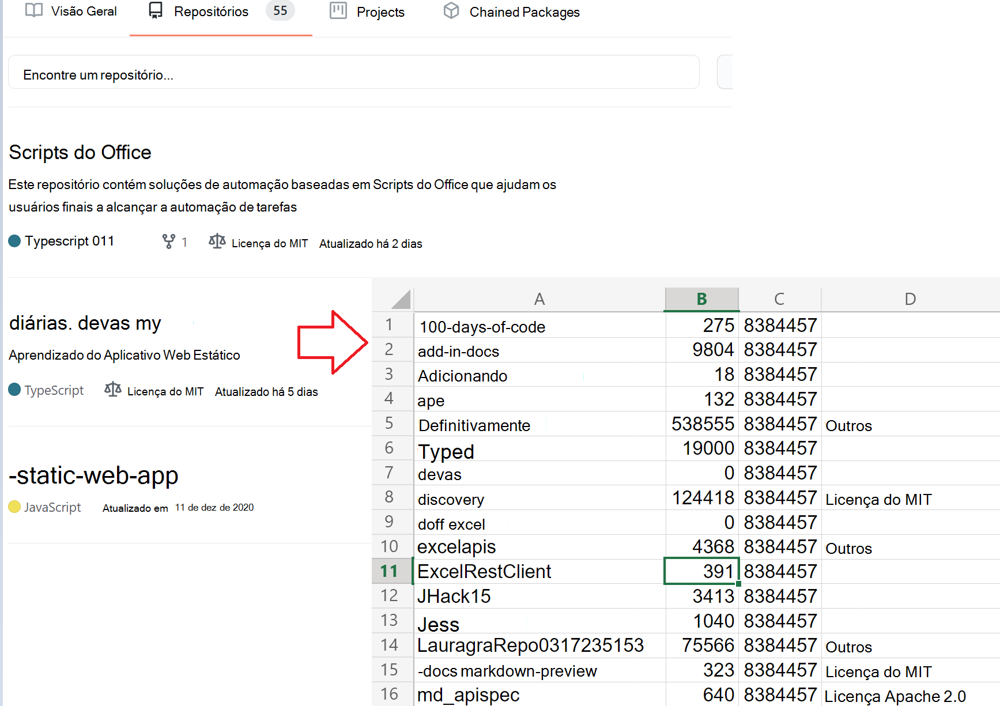
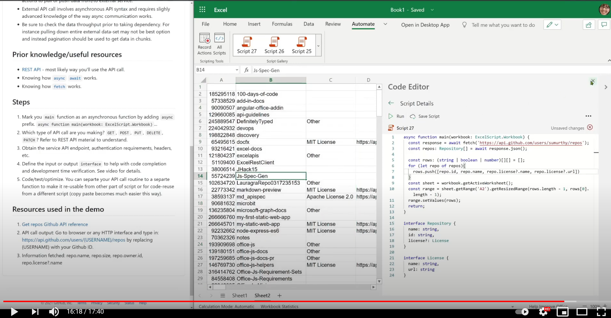

# <a name="use-external-fetch-calls-in-office-scripts"></a><span data-ttu-id="bf1df-103">Usar chamadas de busca externas Office Scripts</span><span class="sxs-lookup"><span data-stu-id="bf1df-103">Use external fetch calls in Office Scripts</span></span>

<span data-ttu-id="bf1df-104">Este script obtém informações básicas sobre os repositórios de GitHub do usuário.</span><span class="sxs-lookup"><span data-stu-id="bf1df-104">This script gets basic information about a user's GitHub repositories.</span></span> <span data-ttu-id="bf1df-105">Ele mostra como usar `fetch` em um cenário simples.</span><span class="sxs-lookup"><span data-stu-id="bf1df-105">It shows how to use `fetch` in a simple scenario.</span></span>

<span data-ttu-id="bf1df-106">Você pode saber mais sobre as APIs GItHub que estão sendo usadas na [referência GitHub API.](https://docs.github.com/rest/reference/repos#list-repositories-for-a-user)</span><span class="sxs-lookup"><span data-stu-id="bf1df-106">You can learn more about the GItHub APIs being used in the [GitHub API reference](https://docs.github.com/rest/reference/repos#list-repositories-for-a-user).</span></span> <span data-ttu-id="bf1df-107">Você também pode ver a saída de chamada de API bruta visitando um navegador da Web (certifique-se de substituir o espaço reservado `https://api.github.com/users/{USERNAME}/repos` {USERNAME} pela ID do Github).</span><span class="sxs-lookup"><span data-stu-id="bf1df-107">You can also see the raw API call output by visiting `https://api.github.com/users/{USERNAME}/repos` in a web browser (be sure to replace the {USERNAME} placeholder with your Github ID).</span></span>



## <a name="sample-code-get-basic-information-about-users-github-repositories"></a><span data-ttu-id="bf1df-109">Código de exemplo: obter informações básicas sobre os repositórios GitHub do usuário</span><span class="sxs-lookup"><span data-stu-id="bf1df-109">Sample code: Get basic information about user's GitHub repositories</span></span>

```TypeScript
async function main(workbook: ExcelScript.Workbook) {

  // Replace the {USERNAME} placeholder with your GitHub username.
  const response = await fetch('https://api.github.com/users/{USERNAME}/repos');
  const repos: Repository[] = await response.json();
  
  const rows: (string | boolean | number)[][] = [];
  for (let repo of repos){ 
    rows.push([repo.id, repo.name, repo.license?.name, repo.license?.url])
  }
  const sheet = workbook.getActiveWorksheet();
  const range = sheet.getRange('A2').getResizedRange(rows.length - 1, rows[0].length - 1);
  range.setValues(rows);
  return;
}

interface Repository {
  name: string,
  id: string,
  license?: License 
}

interface License {
  name: string,
  url: string
}
```

## <a name="training-video-how-to-make-external-api-calls"></a><span data-ttu-id="bf1df-110">Vídeo de treinamento: como fazer chamadas de API externas</span><span class="sxs-lookup"><span data-stu-id="bf1df-110">Training video: How to make external API calls</span></span>

<span data-ttu-id="bf1df-111">[](https://youtu.be/fulP29J418E "Vídeo sobre como fazer chamadas de API externas")</span><span class="sxs-lookup"><span data-stu-id="bf1df-111">[](https://youtu.be/fulP29J418E "Video on how to make external API calls")</span></span>
