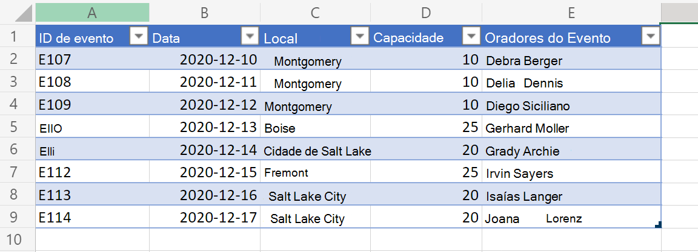
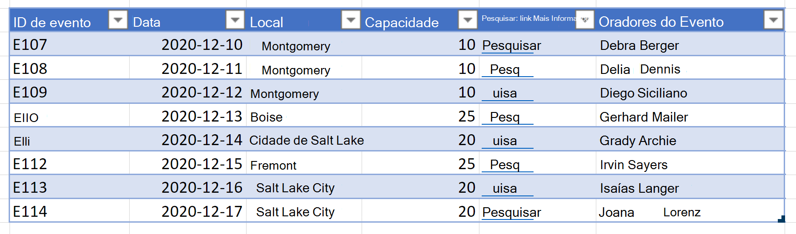

# <a name="output-excel-table-data-as-json-for-usage-in-power-automate"></a><span data-ttu-id="e368d-103">Dados da tabela de saída do Excel como JSON para uso no Power Automate</span><span class="sxs-lookup"><span data-stu-id="e368d-103">Output Excel table data as JSON for usage in Power Automate</span></span>

<span data-ttu-id="e368d-104">Os dados da tabela do Excel podem ser representados como uma matriz de objetos na forma de JSON.</span><span class="sxs-lookup"><span data-stu-id="e368d-104">Excel table data can be represented as an array of objects in the form of JSON.</span></span> <span data-ttu-id="e368d-105">Cada objeto representa uma linha na tabela.</span><span class="sxs-lookup"><span data-stu-id="e368d-105">Each object represents a row in the table.</span></span> <span data-ttu-id="e368d-106">Isso ajuda a extrair os dados do Excel em um formato consistente que é visível para o usuário.</span><span class="sxs-lookup"><span data-stu-id="e368d-106">This helps extract the data from Excel in a consistent format that is visible to the user.</span></span> <span data-ttu-id="e368d-107">Em seguida, os dados podem ser dados para outros sistemas por meio de fluxos do Power Automate.</span><span class="sxs-lookup"><span data-stu-id="e368d-107">The data can then be given to other systems through Power Automate flows.</span></span>

<span data-ttu-id="e368d-108">_Dados da tabela de entrada_</span><span class="sxs-lookup"><span data-stu-id="e368d-108">_Input table data_</span></span>



<span data-ttu-id="e368d-110">Uma variação desse exemplo também inclui os hiperlinks em uma das colunas da tabela.</span><span class="sxs-lookup"><span data-stu-id="e368d-110">A variation of this sample also includes the hyperlinks in one of the table columns.</span></span> <span data-ttu-id="e368d-111">Isso permite que níveis adicionais de dados de células sejam a superfície no JSON.</span><span class="sxs-lookup"><span data-stu-id="e368d-111">This allows additional levels of cell data to be surfaced in the JSON.</span></span>

<span data-ttu-id="e368d-112">_Dados da tabela de entrada que incluem hiperlinks_</span><span class="sxs-lookup"><span data-stu-id="e368d-112">_Input table data that includes hyperlinks_</span></span>



<span data-ttu-id="e368d-114">_Caixa de diálogo para editar hiperlink_</span><span class="sxs-lookup"><span data-stu-id="e368d-114">_Dialog to edit hyperlink_</span></span>


## <a name="sample-excel-file"></a><span data-ttu-id="e368d-116">Exemplo de arquivo do Excel</span><span class="sxs-lookup"><span data-stu-id="e368d-116">Sample Excel file</span></span>

<span data-ttu-id="e368d-117">Baixe o arquivo <a href="table-data-with-hyperlinks.xlsx">table-data-with-hyperlinks.xlsx</a> usado nesses exemplos e experimente você mesmo!</span><span class="sxs-lookup"><span data-stu-id="e368d-117">Download the file <a href="table-data-with-hyperlinks.xlsx">table-data-with-hyperlinks.xlsx</a> used in these samples and try it out yourself!</span></span>

## <a name="sample-code-return-table-data-as-json"></a><span data-ttu-id="e368d-118">Código de exemplo: Retornar dados da tabela como JSON</span><span class="sxs-lookup"><span data-stu-id="e368d-118">Sample code: Return table data as JSON</span></span>

> [!NOTE]
> <span data-ttu-id="e368d-119">Você pode alterar a `interface TableData` estrutura para corresponder às colunas da tabela.</span><span class="sxs-lookup"><span data-stu-id="e368d-119">You can change the `interface TableData` structure to match your table columns.</span></span> <span data-ttu-id="e368d-120">Observe que, para nomes de coluna com espaços, certifique-se de colocar sua chave entre aspas, como com `"Event ID"` no exemplo.</span><span class="sxs-lookup"><span data-stu-id="e368d-120">Note that for column names with spaces, be sure to place your key in quotation marks, such as with `"Event ID"` in the sample.</span></span>

```TypeScript
function main(workbook: ExcelScript.Workbook): TableData[] {
  const table = workbook.getWorksheet('PlainTable').getTables()[0];
  // If you know the table name, you can also do the following:
  // const table = workbook.getTable('Table13436');
  const texts = table.getRange().getTexts();
  let returnObjects: TableData[] = [];
  if (table.getRowCount() > 0)  {
    returnObjects = returnObjectFromValues(texts);
  } 
  console.log(JSON.stringify(returnObjects));  
  return returnObjects
}

function returnObjectFromValues(values: string[][]): TableData[] {
  let objArray = [];
  let objKeys: string[] = [];
  for (let i = 0; i < values.length; i++) {
    if (i === 0) {
      objKeys = values[i]
      continue;
    }
    let obj = {}
    for (let j = 0; j < values[i].length; j++) {
      obj[objKeys[j]] = values[i][j]
    }
    objArray.push(obj);
  }
  return objArray as TableData[];
}

interface BasicObj {
  [key: string]: string
}

interface TableData {
  "Event ID": string
  Date: string
  Location: string
  Capacity: string
  Speakers: string
}
```

### <a name="sample-output"></a><span data-ttu-id="e368d-121">Saída de exemplo</span><span class="sxs-lookup"><span data-stu-id="e368d-121">Sample output</span></span>

```json
[{
    "Event ID": "E107",
    "Date": "2020-12-10",
    "Location": "Montgomery",
    "Capacity": "10",
    "Speakers": "Debra Berger"
}, {
    "Event ID": "E108",
    "Date": "2020-12-11",
    "Location": "Montgomery",
    "Capacity": "10",
    "Speakers": "Delia Dennis"
}, {
    "Event ID": "E109",
    "Date": "2020-12-12",
    "Location": "Montgomery",
    "Capacity": "10",
    "Speakers": "Diego Siciliani"
}, {
    "Event ID": "E110",
    "Date": "2020-12-13",
    "Location": "Boise",
    "Capacity": "25",
    "Speakers": "Gerhart Moller"
}, {
    "Event ID": "E111",
    "Date": "2020-12-14",
    "Location": "Salt Lake City",
    "Capacity": "20",
    "Speakers": "Grady Archie"
}, {
    "Event ID": "E112",
    "Date": "2020-12-15",
    "Location": "Fremont",
    "Capacity": "25",
    "Speakers": "Irvin Sayers"
}, {
    "Event ID": "E113",
    "Date": "2020-12-16",
    "Location": "Salt Lake City",
    "Capacity": "20",
    "Speakers": "Isaiah Langer"
}, {
    "Event ID": "E114",
    "Date": "2020-12-17",
    "Location": "Salt Lake City",
    "Capacity": "20",
    "Speakers": "Johanna Lorenz"
}]
```

## <a name="sample-code-return-table-data-as-json-with-hyperlink-text"></a><span data-ttu-id="e368d-122">Código de exemplo: Retornar dados da tabela como JSON com texto de hiperlink</span><span class="sxs-lookup"><span data-stu-id="e368d-122">Sample code: Return table data as JSON with hyperlink text</span></span>

> [!NOTE]
> <span data-ttu-id="e368d-123">O script sempre extrai hiperlinks da 4ª coluna (índice 0) da tabela.</span><span class="sxs-lookup"><span data-stu-id="e368d-123">The script always extracts hyperlinks from the 4th column (0 index) of the table.</span></span> <span data-ttu-id="e368d-124">Você pode alterar essa ordem ou incluir várias colunas como dados de hiperlink modificando o código no comentário `// For the 4th column (0 index), extract the hyperlink and use that instead of text.`</span><span class="sxs-lookup"><span data-stu-id="e368d-124">You can change that order or include multiple columns as hyperlink data by modifying the code under the comment `// For the 4th column (0 index), extract the hyperlink and use that instead of text.`</span></span>

```TypeScript
function main(workbook: ExcelScript.Workbook): TableData[] {
  const table = workbook.getWorksheet('WithHyperLink').getTables()[0];
  const range = table.getRange();
  // If you know the table name, you can also do the following:
  // const table = workbook.getTable('Table13436');
  const texts = table.getRange().getTexts();
  let returnObjects: TableData[] = [];
  if (table.getRowCount() > 0)  {
    returnObjects = returnObjectFromValues(texts, range);
  } 
  console.log(JSON.stringify(returnObjects));  
  return returnObjects
}

function returnObjectFromValues(values: string[][], range: ExcelScript.Range): TableData[] {
  let objArray = [];
  let objKeys: string[] = [];
  for (let i = 0; i < values.length; i++) {
    if (i === 0) {
      objKeys = values[i]
      continue;
    }
    let obj = {}
    for (let j = 0; j < values[i].length; j++) {
      // For the 4th column (0 index), extract the hyperlink and use that instead of text. 
      if (j === 4) {
        obj[objKeys[j]] = range.getCell(i, j).getHyperlink().address;
      } else {
        obj[objKeys[j]] = values[i][j];
      }
    }
    objArray.push(obj);
  }
  return objArray as TableData[];
}

interface BasicObj {
  [key: string]: string
}

interface TableData {
  "Event ID": string
  Date: string
  Location: string
  Capacity: string
  "Search link": string
  Speakers: string
}
```

### <a name="sample-output"></a><span data-ttu-id="e368d-125">Saída de exemplo</span><span class="sxs-lookup"><span data-stu-id="e368d-125">Sample output</span></span>

```json
[{
    "Event ID": "E107",
    "Date": "2020-12-10",
    "Location": "Montgomery",
    "Capacity": "10",
    "Search link": "https://www.google.com/search?q=Montgomery",
    "Speakers": "Debra Berger"
}, {
    "Event ID": "E108",
    "Date": "2020-12-11",
    "Location": "Montgomery",
    "Capacity": "10",
    "Search link": "https://www.google.com/search?q=Montgomery",
    "Speakers": "Delia Dennis"
}, {
    "Event ID": "E109",
    "Date": "2020-12-12",
    "Location": "Montgomery",
    "Capacity": "10",
    "Search link": "https://www.google.com/search?q=Montgomery",
    "Speakers": "Diego Siciliani"
}, {
    "Event ID": "E110",
    "Date": "2020-12-13",
    "Location": "Boise",
    "Capacity": "25",
    "Search link": "https://www.google.com/search?q=Boise",
    "Speakers": "Gerhart Moller"
}, {
    "Event ID": "E111",
    "Date": "2020-12-14",
    "Location": "Salt Lake City",
    "Capacity": "20",
    "Search link": "https://www.google.com/search?q=salt+lake+city",
    "Speakers": "Grady Archie"
}, {
    "Event ID": "E112",
    "Date": "2020-12-15",
    "Location": "Fremont",
    "Capacity": "25",
    "Search link": "https://www.google.com/search?q=Fremont",
    "Speakers": "Irvin Sayers"
}, {
    "Event ID": "E113",
    "Date": "2020-12-16",
    "Location": "Salt Lake City",
    "Capacity": "20",
    "Search link": "https://www.google.com/search?q=salt+lake+city",
    "Speakers": "Isaiah Langer"
}, {
    "Event ID": "E114",
    "Date": "2020-12-17",
    "Location": "Salt Lake City",
    "Capacity": "20",
    "Search link": "https://www.google.com/search?q=salt+lake+city",
    "Speakers": "Johanna Lorenz"
}]
```

## <a name="use-in-power-automate"></a><span data-ttu-id="e368d-126">Usar no Power Automate</span><span class="sxs-lookup"><span data-stu-id="e368d-126">Use in Power Automate</span></span>

<span data-ttu-id="e368d-127">Para saber como usar esse script no Power Automate, consulte [Create a automated workflow with Power Automate](../../tutorials/excel-power-automate-returns.md#create-an-automated-workflow-with-power-automate).</span><span class="sxs-lookup"><span data-stu-id="e368d-127">For how to use such a script in Power Automate, see [Create an automated workflow with Power Automate](../../tutorials/excel-power-automate-returns.md#create-an-automated-workflow-with-power-automate).</span></span>
