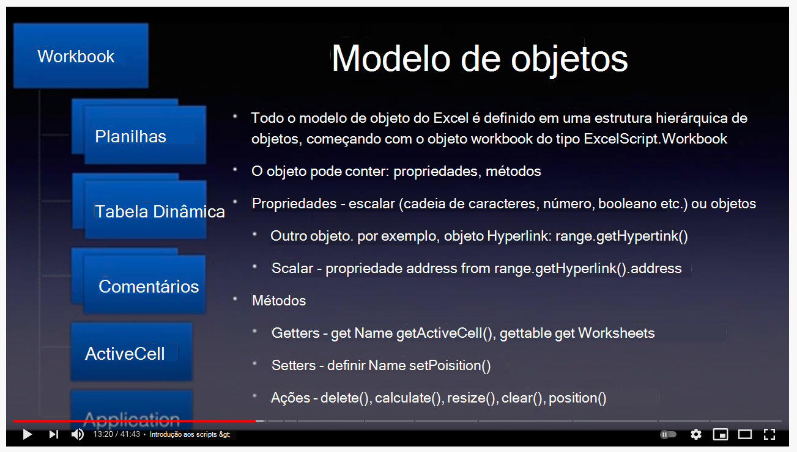
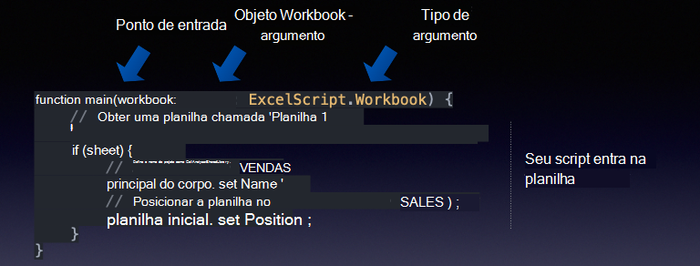
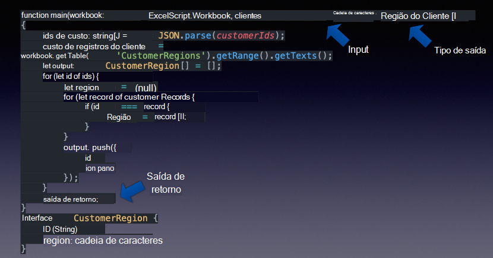
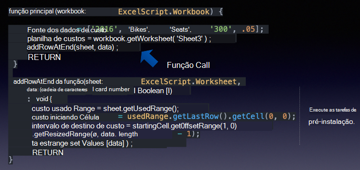
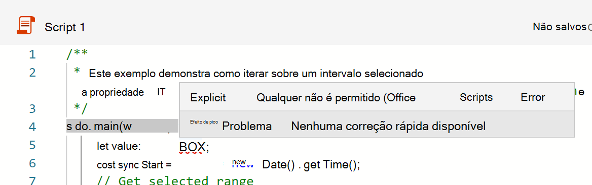
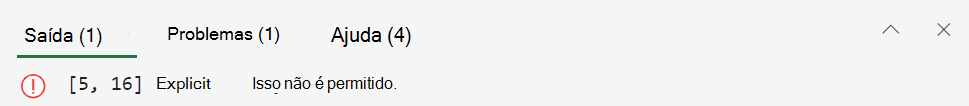
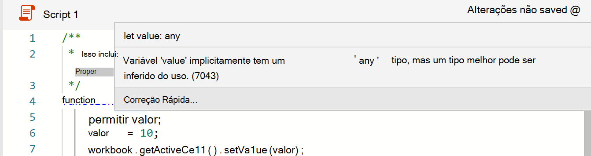
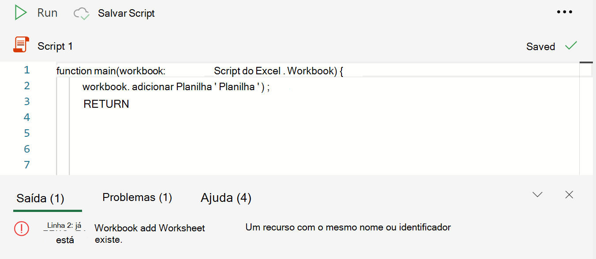
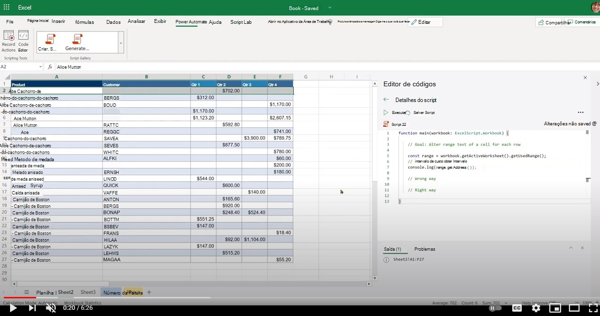

# <a name="getting-started"></a>Introdução

Esta seção fornece detalhes sobre os conceitos básicos dos Scripts do Office, incluindo acesso, ambiente, fundamentos de script e poucos padrões básicos de script.

## <a name="environment-setup"></a>Configuração de ambiente

Saiba mais sobre os conceitos básicos de acesso, ambiente e editor de scripts.

[](https://youtu.be/vvCtxsjPxo8 "Noções básicas do aplicativo scripts do Office")

### <a name="access"></a>Access

Os Scripts do Office exigem configurações de administrador disponíveis para o administrador do Microsoft 365 em **Configurações** da Organização  >  **configurações**  >  **scripts do Office.** Por padrão, ele está ligado para todos os usuários. Há duas subconjunções, que o administrador pode ativar e desativar.

* Capacidade de compartilhar scripts dentro da organização
* Capacidade de usar scripts no Power Automate

Você pode saber se você tem acesso aos Scripts do Office abrindo um  arquivo no Excel na Web (navegador) e vendo se a guia Automatizar aparece na faixa de opções do Excel ou não.
Se você ainda não conseguir ver a guia **Automatizar,** verifique [esta seção de solução de problemas](../../testing/troubleshooting.md#automate-tab-not-appearing-or-office-scripts-unavailable).

### <a name="availability"></a>Disponibilidade

Os Scripts do Office estão disponíveis apenas no Excel na Web para licenças do Enterprise E3+ (contas de consumidor e E1 não são suportadas). Os Scripts do Office ainda não são suportados no Excel no Windows e no Mac.

### <a name="scripts-and-editor"></a>Scripts e editor

O editor de código é integrado ao Excel na Web (versão online). Se você tiver usado editores como Visual Studio Código ou Sublime, essa experiência de edição será bastante semelhante.
A maioria das teclas de atalho Visual Studio editor de código também usa o trabalho na experiência de edição de Scripts do Office. Confira os seguintes apostilas de teclas de atalho.

* [macOS](https://code.visualstudio.com/shortcuts/keyboard-shortcuts-macos.pdf)
* [Windows](https://code.visualstudio.com/shortcuts/keyboard-shortcuts-windows.pdf)

#### <a name="key-things-to-note"></a>Principais coisas a observar

* Os Scripts do Office só estão disponíveis para arquivos armazenados no OneDrive for Business, sites do SharePoint e sites de equipe.
* O editor não mostra a extensão do script. Na verdade, esses são arquivos TypeScript, mas eles são armazenados com uma extensão personalizada chamada `.osts` .
* Os scripts são armazenados em sua própria pasta do OneDrive for `My Files/Documents/OfficeScripts` Business. Você não precisará gerenciar essa pasta. Por sua parte, você pode ignorar esse aspecto enquanto o editor gerencia a experiência de exibição/edição.
* Os scripts não são armazenados como parte dos arquivos do Excel. Eles são armazenados separadamente.
* Você pode compartilhar o script com um arquivo do Excel, o que significa que você está vinculando o script com o arquivo, não anexando-o. Quem tiver acesso ao arquivo do Excel também poderá **exibir,** executar **ou** fazer **uma cópia** do script. Essa é uma diferença importante em comparação com macros VBA.
* A menos que você compartilhe seus scripts, ninguém mais poderá acessá-los como ele reside em sua própria biblioteca.
* Os scripts não podem ser vinculados a partir de um disco local ou locais de nuvem personalizados. Os Scripts do Office só reconhecem e executam um script que está em local predefinido (sua pasta do OneDrive mencionada acima) ou scripts compartilhados.
* Durante a edição, os arquivos são temporariamente salvos no navegador, mas você terá que salvar o script antes de fechar a janela do Excel para salvá-lo no local do OneDrive. Não se esqueça de salvar o arquivo após as edições.

## <a name="gentle-introduction-to-scripting"></a>Introdução suave ao script

Scripts do Office são scripts autônomos escritos no idioma TypeScript que contêm instruções para executar alguma automação em relação à planilha selecionada do Excel. Todas as instruções de automação são autoconstrutivas em um script e os scripts não podem invocar ou chamar outros scripts. Todos os scripts são armazenados em arquivos autônomos e armazenados na pasta do OneDrive do usuário. Você pode gravar um novo script, editar um script gravado ou gravar todo um novo script do zero, tudo dentro de uma interface de editor integrado. A melhor parte dos Scripts do Office é que eles não precisam de mais configuração dos usuários. Sem bibliotecas externas, páginas da Web ou elementos de interface do usuário, configuração etc. Toda a configuração do ambiente é manipulada pelos Scripts do Office e permite acesso fácil e rápido à automação por meio de uma interface de API simples.

Alguns dos conceitos básicos úteis para entender como editar e navegar em torno de scripts incluem:

* Sintaxe básica da linguagem TypeScript
* Noções `main` básicas sobre função e argumentos
* Objetos e hierarquia, métodos, propriedades
* Coleção (matriz): navegação e operações
* Definições de tipo
* Ambiente: registro/edição, executar, examinar resultados, compartilhar

Este vídeo e seção explicam alguns desses conceitos em detalhes.

[](https://youtu.be/8Zsrc1uaiiU "Noções básicas de scripts")

### <a name="language-typescript"></a>Idioma: TypeScript

[Os Scripts](../../index.md) do Office são escritos usando o idioma [TypeScript](https://www.typescriptlang.org/), que é um idioma de código aberto que se constrói em JavaScript (uma das definições de tipo mais usadas do mundo) adicionando definições de tipo estático. Como diz o site, forneça uma maneira de descrever a forma de um objeto, fornecendo uma documentação melhor e permitindo que TypeScript valide que seu `Types` código está funcionando corretamente.

A sintaxe de idioma em si é escrita usando [JavaScript](https://developer.mozilla.org/docs/Web/JavaScript) com tipificações adicionais definidas no script usando convenções TypeScript. Na maioria das vezes, você pode pensar em Scripts do Office como escritos em JavaScript. É essencial que você entenda as noções básicas do idioma JavaScript para iniciar sua jornada de Scripts do Office; embora você não precise ser proficiente para começar sua jornada de automação. Com o gravador de ações do Office Scripts, você pode entender as instruções de script porque os comentários de código estão incluídos e você pode acompanhar e fazer pequenas edições.

As APIs de Scripts do Office, que permitem que o script interaja com o Excel, são projetadas para usuários finais que podem não ter muito plano de fundo de codificação. AS APIs podem ser invocadas de forma síncrona e você não precisa conhecer tópicos avançados, como promessas ou retornos de chamada. O design da API de Scripts do Office fornece:

* Modelo de objeto simples com métodos, getters/setters.
* Coleções de objetos de fácil acesso como matrizes regulares.
* Opções simples de tratamento de erros.
* Desempenho otimizado para cenários selecionados que ajudam os usuários a se concentrarem no cenário em mãos.

### <a name="main-function-the-scripts-starting-point"></a>`main` função: o ponto de partida do script

A execução dos Scripts do Office começa na `main` função. Um script é um único arquivo que contém uma ou muitas funções, juntamente com declarações de tipos, interfaces, variáveis, etc. Para acompanhar o script, comece com a função, pois o Excel sempre invoca a função primeiro `main` quando você executa qualquer `main` script. A função sempre terá pelo menos um argumento (ou parâmetro) chamado , que é apenas um nome de variável que identifica a agenda de trabalho atual com a qual o `main` `workbook` script está sendo executado. Você pode definir argumentos adicionais para uso com a execução do Power Automate (offline).

* `function main(workbook: ExcelScript.Workbook)`

Um script pode ser organizado em funções menores para ajudar na reutilização de código, clareza, etc. Outras funções podem estar dentro ou fora da função principal, mas sempre no mesmo arquivo. Um script é autoconstruido e só pode usar funções definidas no mesmo arquivo. Scripts não podem invocar ou chamar outro Script do Office.

Portanto, em resumo:

* A `main` função é o ponto de entrada para qualquer script. Quando a função é executada, o aplicativo excel invoca essa função principal fornecendo a planilha como seu primeiro parâmetro.
* É importante manter o primeiro argumento e `workbook` sua declaração de tipo como ele aparece. Você pode adicionar novos argumentos à função (consulte a próxima seção), mas mantenha o `main` primeiro argumento como está.



#### <a name="send-or-receive-data-from-other-apps"></a>Enviar ou receber dados de outros aplicativos

Você pode conectar o Excel a outras partes da sua organização executando scripts no [Power Automate](https://flow.microsoft.com). Saiba mais sobre [como executar scripts do Office em fluxos do Power Automate.](../../develop/power-automate-integration.md)

A maneira de receber ou enviar dados de e para o Excel é por meio da `main` função. Pense nele como o gateway de informações que permite que os dados de entrada e de saída sejam descritos e usados no script. Você pode receber dados de fora do script usando o tipo de dados e retornar quaisquer dados reconhecidos pelo TypeScript, como , , ou quaisquer objetos na forma de interfaces que você `string` `string` definir no `number` `boolean` script.



#### <a name="use-functions-to-organize-and-reuse-code"></a>Usar funções para organizar e reutilizar código

Você pode usar funções para organizar e reutilizar código em seu script.



### <a name="objects-hierarchy-methods-properties-collections"></a>Objetos, hierarquia, métodos, propriedades, coleções

Todo o modelo de objeto do Excel é definido em uma estrutura hierárquica de objetos, começando com o objeto workbook do tipo `ExcelScript.Workbook` . Um objeto pode conter métodos, propriedades e outros objetos dentro dele. Os objetos são vinculados uns aos outros usando os métodos. O método de um objeto pode retornar outro objeto ou coleção de objetos. Usar o recurso de IntelliSense (conclusão de código) do editor de código é uma ótima maneira de explorar a hierarquia de objetos. Você também pode usar o [site de documentação de referência oficial](/javascript/api/office-scripts/overview) para acompanhar as relações entre objetos.

Um [objeto](https://developer.mozilla.org/docs/Web/JavaScript/Reference/Global_Objects/Object) é uma coleção de propriedades e uma propriedade é uma associação entre um nome (ou chave) e um valor. O valor de uma propriedade pode ser uma função, nesse caso, a propriedade é conhecida como um método. No caso do modelo de objeto scripts do Office, um objeto representa uma coisa no arquivo do Excel com o qual os usuários interagem, como um gráfico, hiperlink, tabela dinâmica etc. Ele também pode representar o comportamento de um objeto, como os atributos de proteção de uma planilha.

O tópico de objetos TypeScript e propriedades vs métodos é bastante profundo. Para começar a usar o script e ser produtivo, você pode se lembrar de algumas coisas básicas:

* Ambos os objetos e propriedades são acessados usando notação (ponto), com o objeto no lado esquerdo do e a propriedade ou método `.` `.` no lado direito. Exemplos: `hyperlink.address` , `range.getAddress()` .
* As propriedades são escalares na natureza (cadeias de caracteres, booleanos, números). Por exemplo, nome de uma pasta de trabalho, posição de uma planilha, o valor de se a tabela tem um rodapé ou não.
* Os métodos são 'invocados' ou 'executados' usando os parênteses de fechamento aberto. Exemplo: `table.delete()`. Às vezes, um argumento é passado para uma função incluindo-os entre parênteses de fechamento aberto: `range.setValue('Hello')` . Você pode passar muitos argumentos para uma função (conforme definido por seu contrato/assinatura) e separá-los usando `,` .  Por exemplo: `worksheet.addTable('A1:D6', true)`. Você pode passar argumentos de qualquer tipo conforme exigido pelo método, como cadeias de caracteres, número, booleano ou até mesmo outros objetos, por exemplo, , onde é um objeto criado em outro lugar no `worksheet.addTable(targetRange, true)` `targetRange` script.
* Os métodos podem retornar uma coisa como uma propriedade escalar (nome, endereço, etc.) ou outro objeto (intervalo, gráfico) ou não retornar nada (como o caso com `delete` métodos). Você recebe o que o método retorna declarando uma variável ou atribuindo a uma variável existente. Você pode ver isso no lado esquerdo da instrução, como `const table = worksheet.addTable('A1:D6', true)` .
* Na maior parte, o modelo de objeto scripts do Office consiste em objetos com métodos que vinculam várias partes do modelo de objeto do Excel. Muito raramente você se depara com propriedades que são de valores escalares ou de objeto.
* Em Scripts do Office, um método de modelo de objeto do Excel deve conter parênteses abertos. O uso de métodos sem eles não é permitido (como atribuir um método a uma variável).

Vamos ver alguns métodos no `workbook` objeto.

```TypeScript
function main(workbook: ExcelScript.Workbook) {
    // Return a boolean (true or false) setting of whether the workbook is set to auto-save or not. 
    const autoSave = workbook.getAutoSave(); 
    // Get workbook name.
    const name = workbook.getName();
    // Get active cell range object.
    const cell = workbook.getActiveCell();
    // Get table named SALES.
    const cell = workbook.getTable('SALES');
    // Get all slicer objects.
    const slicers = workbook.getSlicers();
}
```

Neste exemplo:

* Os métodos do `workbook` objeto, como e retornam uma propriedade `getAutoSave()` escalar `getName()` (cadeia de caracteres, número, booleano).
* Métodos como retornar `getActiveCell()` outro objeto.
* O `getTable()` método aceita um argumento (nome da tabela neste caso) e retorna uma tabela específica na caixa de trabalho.
* O método retorna uma matriz (referida em muitos lugares como uma coleção) de todos os objetos `getSlicers()` slicer dentro da lista de trabalho.

Você observará que todos esses métodos têm um prefixo, que é apenas uma convenção usada no modelo de objeto scripts do Office para transmitir que o método `get` está retornando algo. Eles também são comumente chamados de "getters".

Há dois outros tipos de métodos que veremos agora no próximo exemplo:

```TypeScript
function main(workbook: ExcelScript.Workbook) {
    // Get a worksheet named 'Sheet1.
    const sheet = workbook.getWorksheet('Sheet1'); 
    // Set name to SALES.
    sheet.setName('SALES');
    // Position the worksheet at the beginning.
    sheet.setPosition(0);
}
```

Neste exemplo:

* O `setName()` método define um novo nome para a planilha. `setPosition()` define a posição como a primeira célula.
* Esses métodos modificam o arquivo do Excel definindo uma propriedade ou comportamento da pasta de trabalho. Esses métodos são chamados de "setters".
* Normalmente, os "setters" têm um "getter" de parceiro, por exemplo, e , ambos `worksheet.getPosition` `worksheet.setPosition` são métodos.

#### <a name="undefined-and-null-primitive-types"></a>`undefined` e `null` tipos primitivos

Veja a seguir dois tipos de dados primitivos que você deve estar ciente:

1. O valor [`null`](https://developer.mozilla.org/docs/Web/JavaScript/Reference/Global_Objects/null) representa a ausência intencional de qualquer valor de objeto. É um dos valores primitivos do JavaScript e é usado para indicar que uma variável não tem valor.
1. Uma variável que não foi atribuída a um valor é do tipo [`undefined`](https://developer.mozilla.org/docs/Web/JavaScript/Reference/Global_Objects/undefined) . Um método ou instrução também pode retornar se a variável `undefined` avaliada não tiver um valor atribuído.

Esses dois tipos são recortados como parte do tratamento de erros e podem causar bastante dor de cabeça se não for tratado corretamente. Felizmente, TypeScript/JavaScript oferece uma maneira de verificar se uma variável é do tipo `undefined` ou `null` . Vamos falar sobre algumas dessas verificações em seções posteriores, incluindo o tratamento de erros.

#### <a name="method-chaining"></a>Encadeamento de método

Você pode usar a notação de ponto para conectar objetos que estão sendo retornados de um método para reduzir seu código. Às vezes, essa técnica torna o código fácil de ler e gerenciar. No entanto, há poucas coisas a serem cientes. Vejamos os exemplos a seguir.

O código a seguir obtém a célula ativa e a próxima célula e define o valor. Esse é um bom candidato para usar encadeamento, pois esse código terá êxito o tempo todo.

```TypeScript
function main(workbook: ExcelScript.Workbook) {
    workbook.getActiveCell().getOffsetRange(0,1).setValue('Next cell');
}
```

No entanto, o código a seguir (que obtém uma tabela chamada **SALES** e liga seu estilo de coluna em faixa) tem um problema.

```TypeScript
function main(workbook: ExcelScript.Workbook) {
  workbook.getTable('SALES').setShowBandedColumns(true);
}
```

E se a **tabela SALES** não existir? O script falhará com um erro (mostrado a seguir) porque retorna (que é um `getTable('SALES')` tipo JavaScript indicando que não há tabela como `undefined` **SALES**). Chamar o `setShowBandedColumns` método em não faz `undefined` sentido, ou seja, `undefined.setShowBandedColumns(true)` e, portanto, o script termina em um erro.

```text
Line 2: Cannot read property 'setShowBandedColumns' of undefined
```

Você pode [](https://developer.mozilla.org/docs/Web/JavaScript/Reference/Operators/Optional_chaining) usar o operador de encadeamento opcional que fornece uma maneira de simplificar o acesso a valores por meio de objetos conectados quando for possível que uma referência ou método seja ou (que é a maneira do JavaScript indicar um objeto ou resultado não atribuído ou inexistente) para lidar com essa `undefined` `null` condição.

```TypeScript
function main(workbook: ExcelScript.Workbook) {
    // This line will not fail as the setShowBandedColumns method is executed only if the SALES table is present.
    workbook.getTable('SALES')?.setShowBandedColumns(true); 
}
```

Se você deseja manipular condições de objeto inexistentes ou tipo que está sendo retornado por um método, é melhor atribuir o valor de retorno do método e lidar com isso `undefined` separadamente.

```TypeScript
function main(workbook: ExcelScript.Workbook) {
    const salesTable = workbook.getTable('SALES');
    if (salesTable) {
        salesTable.setShowBandedColumns(true);
    } else { 
        // Handle this condition.
    }
}
```

#### <a name="get-object-reference"></a>Obter referência de objeto

O `workbook` objeto é dado a você na `main` função. Você pode começar a usar o `workbook` objeto e acessar seus métodos diretamente.

```TypeScript
function main(workbook: ExcelScript.Workbook) {
    // Get workbook name.
    const name = workbook.getName();
    // Display name to console.
    console.log(name);
}
```

Para usar todos os outros objetos dentro da lista de trabalho, comece com o objeto e vá para baixo da hierarquia até chegar ao `workbook` objeto que você está procurando. Você pode obter a referência do objeto buscando o objeto usando seu método ou recuperando a coleção de `get` objetos, conforme mostrado abaixo:

```TypeScript
function main(workbook: ExcelScript.Workbook) {
    // Get the active worksheet.
    const sheet = workbook.getActiveWorksheet();
    // Fetch using an ID or key.
    const sheet = workbook.getWorksheet('SomeSheetName');
    // Invoke methods on the object.
    sheet.setPosition(0); 
    
    // Get collection of methods.
    const tables = sheet.getTables();
    console.log('Total tables in this sheet: ' + tables.length);
}
```

#### <a name="check-if-an-object-exists-then-delete-and-add"></a>Verifique se existe um objeto, exclua e adicione

Para criar um objeto, digamos com um nome predefinido, é sempre melhor remover um objeto semelhante que pode existir e, em seguida, adicioná-lo. Você pode fazer isso usando o padrão a seguir.

```TypeScript
function main(workbook: ExcelScript.Workbook) {
  // Name of the worksheet to be added. 
  let name = "Index";
  // Check if the worksheet already exists. If not, add the worksheet.
  let sheet = workbook.getWorksheet('Index');
  if (sheet) {
    console.log(`Worksheet by the name ${name} already exists. Deleting it.`);
    // Call the delete method on the object to remove it. 
    sheet.delete();
  } 
    // Add a blank worksheet. 
  console.log(`Adding the worksheet named  ${name}.`)
  const indexSheet = workbook.addWorksheet("Index");
}

```

Como alternativa, para excluir um objeto que pode ou não existir, use o padrão a seguir.

```TypeScript
    // The ? preceding delete() will ensure that the API is only invoked if the object exists. 
    workbook.getWorksheet('Index')?.delete(); 
```

#### <a name="note-about-adding-an-object"></a>Observação sobre a adição de um objeto

Para criar, inserir ou adicionar um objeto como uma slicer, tabela dinâmica, planilha etc., use o **método** add_Object_ correspondente. Esse método está disponível em seu objeto pai. Por exemplo, o `addChart()` método está disponível no `worksheet` objeto. O **add_Object_** retorna o objeto que ele cria. Receba o valor retornado e use-o posteriormente em seu script.

```TypeScript
function main(workbook: ExcelScript.Workbook) {
  // Add object and get a reference to it. 
  const indexSheet = workbook.addWorksheet("Index");
  // Use it elsewhere in the script 
  console.log(indexSheet.getPosition());
}

```

Como alternativa, para excluir um objeto que pode ou não existir, use este padrão:

```TypeScript
    workbook.getWorksheet('Index')?.delete(); // The ? preceding delete() will ensure that the API is only invoked if the object exists. 
```

#### <a name="collections"></a>Coleções

Coleções são objetos como tabelas, gráficos, colunas etc. que podem ser recuperados como uma matriz e iterados para processamento. Você pode recuperar uma coleção usando o método correspondente e processar os dados em um loop usando uma das muitas técnicas de transição da matriz `get` TypeScript, como:

* [`for` ou `while`](https://developer.mozilla.org/docs/Web/JavaScript/Guide/Loops_and_iteration)
* [`for..of`](https://developer.mozilla.org/docs/Web/JavaScript/Reference/Statements/for...of)
* [`forEach`](https://developer.mozilla.org/docs/Web/JavaScript/Reference/Global_Objects/Array/forEach)

* [Noções básicas de idiomas de matrizes](https://developer.mozilla.org//docs/Learn/JavaScript/First_steps/Arrays)

Este script demonstra como usar coleções com suporte em APIs de Scripts do Office. Ele colore cada guia de planilha no arquivo com uma cor aleatória.

```TypeScript
function main(workbook: ExcelScript.Workbook) {

  // Get all sheets as a collection.
  const sheets = workbook.getWorksheets();
  const names = sheets.map ((sheet) => sheet.getName());
  console.log(names);
  console.log(`Total worksheets inside of this workbook: ${sheets.length}`);
  // Get information from specific sheets within the collection.
  console.log(`First sheet name is: ${names[0]}`);
  if (sheets.length > 1) {
    console.log(`Last sheet's Id is: ${sheets[sheets.length -1].getId()}`);
  }
  // Color each worksheet with random color.
  for (const sheet of sheets) {
    sheet.setTabColor(`#${Math.random().toString(16).substr(-6)}`);
  }
}
```

## <a name="type-declarations"></a>Declarações de tipo

Declarações de tipo ajudam os usuários a entender o tipo de variável com a qual estão lidando. Ele ajuda na conclusão automática de métodos e ajuda nas verificações de qualidade do tempo de desenvolvimento.

Você pode encontrar declarações de tipo no script em vários locais, incluindo declaração de função, declaração de variável, IntelliSense definições, etc.

Exemplos:

* `function main(workbook: ExcelScript.Workbook)`
* `let myRange: ExcelScript.Range;`
* `function getMaxAmount(range: ExcelScript.Range): number`

Você pode identificar os tipos facilmente no editor de código, pois ele geralmente aparece distintamente em uma cor diferente. Um dois `:` pontos geralmente precede a declaração de tipo.  

Os tipos de escrita podem ser opcionais em TypeScript porque a inferência de tipo permite que você receba muita energia sem escrever código adicional. Na maior parte, o idioma TypeScript é bom para inferir os tipos de variáveis. No entanto, em determinados casos, os Scripts do Office exigem que as declarações de tipo sejam explicitamente definidas se o idioma não puder identificar claramente o tipo. Além disso, explícito ou `any` implícito não é permitido no Script do Office. Mais informações sobre isso mais tarde.

### <a name="excelscript-types"></a>`ExcelScript` types

Em Scripts do Office, você usará os seguintes tipos de tipos.

* Tipos de idioma `number` nativo, como `string` , , , , , `object` `boolean` `null` etc.
* Tipos de API do Excel. Eles começam com `ExcelScript` . Por exemplo, `ExcelScript.Range` , `ExcelScript.Table` , etc.
* Quaisquer interfaces personalizadas que você possa ter definido no script usando `interface` instruções.

Consulte exemplos de cada um desses grupos em seguida.

**_Tipos de idioma nativo_**

No exemplo a seguir, observe locais `string` onde , e foram `number` `boolean` usados. Esses são tipos **de idioma TypeScript** nativos.

```TypeScript
function main(workbook: ExcelScript.Workbook)
{
  const table = workbook.getActiveWorksheet().getTables()[0];
  const sales = table.getColumnByName('Sales').getRange().getValues();
  console.log(sales);
  // Add 100 to each value.
  const revisedSales = salesAs1DArray.map(data => data as number + 100);
  // Add a column.
  table.addColumn(-1, revisedSales);  
}
/**
 * Extract a column from 2D array and return result.
 */
function extractColumn(data: (string | number | boolean)[][], index: number): (string | number | boolean)[] {

  const column = data.map((row) => {
    return row[index];
  })
  return column;
}
/**
 * Convert a flat array into a 2D array that can be used as range column.
 */
function convertColumnTo2D(data: (string | number | boolean)[]): (string | number | boolean)[][] {

  const columnAs2D = data.map((row) => {
    return [row];
  })
  return columnAs2D;
}
```

**_Tipos do ExcelScript_**

No exemplo a seguir, uma função auxiliar tem dois argumentos. O primeiro é a `sheet` variável que é do `ExcelScript.Worksheet` tipo.

```TypeScript
function main(workbook: ExcelScript.Workbook) {
    const sheet = workbook.getWorksheet('Sheet5');
    const data = ['2016', 'Bikes', 'Seats', '1500', .05];
    addRow(sheet, data);
    return;
}

function addRow(sheet: ExcelScript.Worksheet, data: (string | number | boolean)[]): void {

    const usedRange = sheet.getUsedRange();
    let startCell: ExcelScript.Range;
    // If the sheet is empty, then use A1 as starting cell for update.
    if (usedRange) { 
      startCell = usedRange.getLastRow().getCell(0, 0).getOffsetRange(1, 0);
    } else {
      startCell = sheet.getRange('A1');
    }
    console.log(startCell.getAddress());
    const targetRange = startCell.getResizedRange(0, data.length - 1);      
    targetRange.setValues([data]);
    return;
}
```

**_Tipos personalizados_**

A interface personalizada `ReportImages` é usada para retornar imagens para outra ação de fluxo. A `main` declaração de função inclui instruções para dizer a TypeScript que um objeto desse tipo está sendo `: ReportImages` retornado.

```TypeScript
function main(workbook: ExcelScript.Workbook): ReportImages {
  let chart = workbook.getWorksheet("Sheet1").getCharts()[0];
  const table = workbook.getWorksheet('InvoiceAmounts').getTables()[0];
  
  const chartImage = chart.getImage();
  const tableImage = table.getRange().getImage();
  return {
    chartImage,
    tableImage
  }
}

interface ReportImages {
  chartImage: string
  tableImage: string
}
```

### <a name="type-assertion-overriding-the-type"></a>Tipo de afirmação (substituindo o tipo)

Como diz a documentação [TypeScript,](https://www.typescriptlang.org/docs/handbook/basic-types.html#type-assertions) "Às vezes, você terminará em uma situação em que você conhecerá mais sobre um valor do que TypeScript. Normalmente, isso acontecerá quando você sabe que o tipo de alguma entidade pode ser mais específico do que seu tipo atual. As declarações de tipo são uma maneira de dizer ao compilador "confie em mim, eu sei o que estou fazendo". Uma afirmação de tipo é como um tipo lançado em outros idiomas, mas não executa nenhuma verificação especial ou reestruturação de dados. Ele não tem impacto no tempo de execução e é usado puramente pelo compilador."

Você pode afirmar o tipo usando a `as` palavra-chave ou usando colchetes angulares, conforme mostrado no código a seguir.

```TypeScript
function main(workbook: ExcelScript.Workbook) {
  let data = workbook.getActiveCell().getValue();
  // Since the add10 function only accepts number, assert data's type as number, otherwise the script cannot be run.
  const answer1 = add10(data as number);
  const answer2 = add10(<number> data);
}

function add10(data: number) { 
  return data + 10;
}
```

#### <a name="any-type-in-the-script"></a>Tipo 'any' no script

O [site TypeScript afirma](https://www.typescriptlang.org/docs/handbook/basic-types.html#any):

  Em algumas situações, nem todas as informações de tipo estão disponíveis ou sua declaração levaria uma quantidade inadequada de esforço. Isso pode ocorrer para valores de código que foi gravado sem TypeScript ou uma biblioteca de terceiros. Nesses casos, podemos optar por não fazer a verificação de tipos. Para fazer isso, rotularemos esses valores com o `any` tipo:

  ```TypeScript
  declare function getValue(key: string): any;
  // OK, return value of 'getValue' is not checked
  const str: string = getValue("myString");
  ```

**Não `any` é permitido explicitar**

```TypeScript
// This is not allowed
let someVariable: any; 
```

O `any` tipo apresenta desafios à maneira como os Scripts do Office processam as APIs do Excel. Causa problemas quando as variáveis são enviadas para APIs do Excel para processamento. Conhecer o tipo de variáveis usadas no script é essencial para o processamento do script e, portanto, a definição explícita de qualquer variável com `any` tipo é proibida. Você receberá um erro de tempo de compilação (erro antes de executar o script) se houver qualquer variável com o tipo `any` declarado no script. Você também verá um erro no editor.





No código exibido na imagem anterior, indica que a linha 5 coluna `[5, 16] Explicit Any is not allowed` 16 declara o `any` tipo. Isso ajuda você a localizar a linha de código que contém o erro.

Para se livrar desse problema, declare sempre o tipo da variável.

Se você não tiver certeza sobre o tipo de variável, um truque legal no TypeScript permite definir tipos [de união.](https://www.typescriptlang.org/docs/handbook/unions-and-intersections.html) Isso pode ser usado para variáveis para manter um intervalo de valores, que pode ser de vários tipos.

```TypeScript
// Define value as a union type rather than 'any' type.
let value: (string | number | boolean);
value = someValue_from_another_source;
//...
someRange.setValue(value);
```

### <a name="type-inference"></a>Digite inferência

No TypeScript, há vários locais onde a [inferência](https://www.typescriptlang.org/docs/handbook/type-inference.html) de tipo é usada para fornecer informações de tipo quando não há anotação de tipo explícito. Por exemplo, o tipo da variável x é inferido como um número no código a seguir.

```TypeScript
let x = 3;
//  ^ = let x: number
```

Esse tipo de inferência ocorre ao inicializar variáveis e membros, definir valores padrão do parâmetro e determinar tipos de retorno de função.

### <a name="no-implicit-any-rule"></a>no-implicit-any rule

Um script requer os tipos das variáveis usadas para serem declaradas explicitamente ou implicitamente. Se o compilador TypeScript não conseguir determinar o tipo de uma variável (porque o tipo não é declarado explicitamente ou a inferência de tipo não é possível), você receberá um erro de tempo de compilação (erro antes de executar o script). Você também verá um erro no editor.



Os scripts a seguir têm erros de tempo de compilação porque as variáveis são declaradas sem tipos e TypeScript não pode determinar o tipo no momento da declaração.

```TypeScript
function main(workbook: ExcelScript.Workbook) {
    // The variable 'value' gets 'any' type
    // because no type is declared.
    let value; 
    // Even when a number type is assigned,
    // the type of 'value' remains any.
    value = 10; 
    // The following statement fails because
    // Office Scripts can't send an argument
    // of type 'any' to Excel for processing.
    workbook.getActiveCell().setValue(value);
    return;
}
```

```TypeScript
function main(workbook: ExcelScript.Workbook) {
    // The variable 'cell' gets 'any' type
    // because no type is defined.
    let cell; 
    cell = workbook.getActiveCell().getValue();
    // Office Scripts can't assign Range type object
    // to a variable of 'any' type.
    console.log(cell.getValue());
    return;
}
```

Para evitar esse erro, use os padrões a seguir. Em cada caso, a variável e seu tipo são declaradas ao mesmo tempo.

```TypeScript
function main(workbook: ExcelScript.Workbook) {
    const value: number = 10; 
    workbook.getActiveCell().setValue(value);
    return;
}
```

```TypeScript
function main(workbook: ExcelScript.Workbook) {
    const cell: ExcelScript.Range = workbook.getActiveCell().getValue();
    console.log(cell.getValue()); 
    return;
}
```

## <a name="error-handling"></a>Tratamento de erros

O erro de Scripts do Office pode ser classificado em uma das seguintes categorias.

1. Aviso de tempo de compilação mostrado no editor
1. Erro de tempo de compilação que aparece quando você é executado, mas ocorre antes do início da execução
1. Erro de tempo de execução

Os avisos do editor podem ser identificados usando os sublinhados vermelho ondulados no editor:


Às vezes, você também pode ver sublinhados de aviso laranja e mensagens informativas cinza. Eles devem ser examinados de perto, embora não causem erros.

Não é possível distinguir entre erros de tempo de compilação e tempo de execução, pois ambas as mensagens de erro são idênticas. Ambos ocorrem quando você realmente executa o script. As imagens a seguir mostram exemplos de um erro de tempo de compilação e um erro de tempo de execução.




Em ambos os casos, você verá o número da linha onde ocorreu o erro. Em seguida, você pode examinar o código, corrigir o problema e executar novamente.

A seguir estão algumas práticas recomendadas para evitar erros de tempo de execução.

### <a name="check-for-object-existence-before-deletion"></a>Verificar a existência do objeto antes da exclusão

Como alternativa, para excluir um objeto que pode ou não existir, use este padrão:

```TypeScript
// The ? ensures that the delete() API is only invoked if the object exists.
workbook.getWorksheet('Index')?.delete();

// Alternative:
const indexSheet = workbook.getWorksheet('Index');
if (indexSheet) {
    indexSheet.delete();
}
```

### <a name="do-pre-checks-at-the-beginning-of-the-script"></a>Fazer verificações prévias no início do script

Como prática prática, sempre certifique-se de que todas as suas entradas estão presentes no arquivo do Excel antes de executar seu script. Você pode ter feito algumas suposições sobre os objetos que estão presentes na workbook. Se esses objetos não existirem, seu script poderá encontrar um erro ao ler o objeto ou seus dados. Em vez de começar o processamento e o erro no meio depois que parte das atualizações ou processamento já tiver terminado, é melhor fazer todas as pré-verificações no início do script.

Por exemplo, o script a seguir requer que duas tabelas chamadas Table1 e Table2 estão presentes. Portanto, o script verifica sua presença e termina com a instrução e `return` uma mensagem apropriada se eles não estão presentes.

```TypeScript
function main(workbook: ExcelScript.Workbook) {

  // Tables that should be in the workbook for the script to work:
  const TargetTableName = 'Table1';
  const SourceTableName = 'Table2';

  // Get the table objects.
  let targetTable = workbook.getTable(TargetTableName);
  let sourceTable = workbook.getTable(SourceTableName);

  if (!targetTable || !sourceTable) {
    console.log(`Required tables missing - Check that both source (${TargetTableName}) and target (${SourceTableName}) tables are present before running the script.`);
    return;
  }

  // Continue....
}
```

Se a verificação para garantir que a presença de dados de entrada está acontecendo em uma função separada, é importante encerrar o script em emissão da instrução `return` da `main` função.

No exemplo a seguir, `main` a função chama a função para fazer as `inputPresent` verificações prévias. `inputPresent` retorna um booleano ( ou ) indicando se todas `true` as entradas necessárias estão presentes ou `false` não. Em seguida, é responsabilidade da função emitir a instrução (ou seja, de dentro `main` `return` da `main` função) para encerrar o script imediatamente.

```TypeScript
function main(workbook: ExcelScript.Workbook) {

  // Get the table objects.
  if (!inputPresent(workbook)) {
    return;
  }

  // Continue....
}

function inputPresent( workbook: ExcelScript.Workbook): boolean {

  // Tables that should be in the workbook for the script to work:
  const TargetTableName = 'Table1';
  const SourceTableName = 'Table2';

  // Get the table objects.
  let targetTable = workbook.getTable(TargetTableName);
  let sourceTable = workbook.getTable(SourceTableName);

  if (!targetTable || !sourceTable) {
    console.log(`Required tables missing - Check that both source (${TargetTableName}) and target (${SourceTableName}) tables are present before running the script.`);
    return false;
  }
  return true;
}
```

### <a name="when-to-abort-throw-the-script"></a>Quando abortar ( `throw` ) o script  

Na maior parte, você não precisa abortar ( `throw` ) do seu script. Isso ocorre porque o script geralmente informa ao usuário que o script não foi executado devido a um problema. Na maioria dos casos, é suficiente terminar o script com uma mensagem de erro e `return` uma instrução da `main` função.

No entanto, se o script estiver sendo executado como parte do Power Automate, talvez você queira cancelar o fluxo se determinadas condições não são atendidas. Portanto, é importante não sobre um erro, mas sim emitir uma instrução para abortar o script para que quaisquer instruções de código subsequentes `return` `throw` não são executados.

```TypeScript
function main(workbook: ExcelScript.Workbook) {

  // Tables that should be in the workbook for the script to work:
  const TargetTableName = 'Table1';
  const SourceTableName = 'Table2';

  // Get the table objects.
  let targetTable = workbook.getTable(TargetTableName);
  let sourceTable = workbook.getTable(SourceTableName);

  if (!targetTable || !sourceTable) {
    // Abort script.
    throw `Required tables missing - Check that both source (${TargetTableName}) and target (${SourceTableName}) tables are present before running the script.`;
  }
  
```

Conforme mencionado na seção a seguir, outro cenário é quando você tem várias funções envolvidas ( chamadas que chamam `main` , etc.) o que dificulta a `functionX` propagação do `functionY` erro. A anulação/lançamento da função aninhada com uma mensagem pode ser mais fácil do que retornar um erro até e retornar com `main` `main` uma mensagem de erro.

### <a name="when-to-use-trycatch-throw-exception"></a>Quando usar try.. catch (exceção de lançamento)

A [`try..catch`](https://developer.mozilla.org/docs/Web/JavaScript/Reference/Statements/try...catch) técnica é uma maneira de detectar se uma chamada de API falhou e lidar com esse erro no script. Talvez seja importante verificar o valor de retorno de uma API para verificar se ele foi concluído com êxito.

Considere o trecho de exemplo a seguir.

```TypeScript
function main(workbook: ExcelScript.Workbook) {

  // Somewhere in the script, perform a large data update.
  range.setValues(someLargeValues);

}
```

A `setValues()` chamada pode falhar e resultar na falha do script. Talvez você queira lidar com essa condição em seu código e, talvez, personalizar a mensagem de erro ou separar a atualização em unidades menores, etc. Nesse caso, é importante saber que a API retornou um erro e interpretar ou manipular esse erro.

```TypeScript
try {
    range.setValues(someLargeValues);
} catch (error) {
    console.log(`The script failed to update the values at location ____. Please inspect and run again.`);
    console.log(error);
    return; // End script (assuming this is in main function).
}

// OR...

try {
    range.setValues(someLargeValues);
} catch (error) {
    console.log(`The script failed to update the values at location ____. Trying a different approach`);
    handleUpdatesInSmallerChunks(someLargeValues);
}

// Continue...
}
```

Outro cenário é quando a função principal chama outra função, que, por sua vez, chama outra função (e assim por diante).), e a chamada da API que você se importa acontece na função inferior. Propagar o erro até pode não ser `main` viável ou conveniente. Nesse caso, lançar um erro na função inferior será mais conveniente.

```TypeScript

function main(workbook: ExcelScript.Workbook) {
    ...
    updateRangeInChunks(sheet.getRange("B1"), data);
    ...
}

function updateRangeInChunks(
    ...
    updateNextChunk(startCell, values, rowsPerChunk, totalRowsUpdated);
    ...
}

function updateTargetRange(
      targetCell: ExcelScript.Range,
      values: (string | boolean | number)[][]
    ) {
    const targetRange = targetCell.getResizedRange(values.length - 1, values[0].length - 1);
    console.log(`Updating the range: ${targetRange.getAddress()}`);
    try {
      targetRange.setValues(values);
    } catch (e) {
      throw `Error while updating the whole range: ${JSON.stringify(e)}`;
    }
    return;
}
```

*Aviso:* o `try..catch` uso dentro de um loop diminuirá o script. Evite usar isso dentro ou ao redor de loops.

## <a name="range-basics"></a>Noções básicas de intervalo

Confira [Noções básicas de intervalo antes](range-basics.md) de ir mais longe em sua jornada.

## <a name="basic-performance-considerations"></a>Considerações básicas sobre o desempenho

### <a name="avoid-slow-operations-in-the-loop"></a>Evitar operações lentas no loop

Determinadas operações quando realizadas dentro/ao redor das instruções de loop, como `for` , , , , `for..of` `map` `forEach` etc. podem levar a um desempenho lento. Evite as seguintes categorias de API.

* `get*` APIs

Leia todos os dados necessários fora do loop em vez de lê-los dentro do loop. Às vezes, é difícil evitar a leitura dentro de loops; nesse caso, certifique-se de que suas contagens de loop não sejam muito grandes ou gerencie-as em lotes para evitar ter que fazer loop por meio de uma estrutura de dados grande.

**Observação:** se o intervalo/dados com que você está lidando for bastante grande (digamos que células de 100 mil >, talvez seja necessário usar técnicas avançadas como separar suas leituras/gravações em várias partes. O vídeo a seguir é realmente para uma configuração de dados de pequeno porte. Para um grande conjuntos de dados, consulte o [cenário avançado de gravação de dados.](write-large-dataset.md)

[](https://youtu.be/lsR_GvVW3Pg "Vídeo mostrando dica de otimização de leitura e gravação")

* `console.log` instrução (consulte o exemplo a seguir)

```TypeScript
// Color each cell with random color.
for (let row = 0; row < rows; row++) {
    for (let col = 0; col < cols; col++) {
        range
            .getCell(row, col)
            .getFormat()
            .getFill()
            .setColor(`#${Math.random().toString(16).substr(-6)}`);
        /* Avoid such console.log inside loop */
        // console.log("Updating" + range.getCell(row, col).getAddress());
    }
}
```

* `try {} catch ()` instrução

Evite loops de `for` tratamento de exceção. Loops dentro e fora.

## <a name="note-to-vba-developers"></a>Observação para desenvolvedores do VBA

O idioma TypeScript difere do VBA tanto de forma síncte quanto em convenções de nomenal.

Confira os trechos equivalentes a seguir.

```vba
Worksheets("Sheet1").Range("A1:G37").Clear
```

```TypeScript
workbook.getWorksheet('Sheet1').getRange('A1:G37').clear(ExcelScript.ClearApplyTo.all);
```

Algumas coisas a ser chamada sobre TypeScript:

* Você pode observar que todos os métodos precisam ter parênteses abertos para execução. Os argumentos são passados de forma idêntica, mas alguns argumentos podem ser necessários para execução (ou seja, obrigatório versus opcional).
* A convenção de nomenisagem segue camelCase em vez da convenção PascalCase.
* Os métodos geralmente têm `get` `set` ou prefixos indicando se ele está lendo ou escrevendo membros do objeto.
* Os blocos de código são definidos e identificados por chaves abertas: `{` `}` . Os blocos são necessários para `if` condições, `while` instruções, `for` loops, definições de função, etc.
* As funções podem chamar outras funções e você pode até definir funções dentro de uma função.

Em geral, TypeScript é um idioma diferente e há poucas semelhanças entre eles. No entanto, a PRÓPRIA API de Scripts do Office usa terminologia semelhante e hierarquia de modelo de dados (modelo de objeto) como APIs VBA e isso deve ajudá-lo a navegar por aí.
