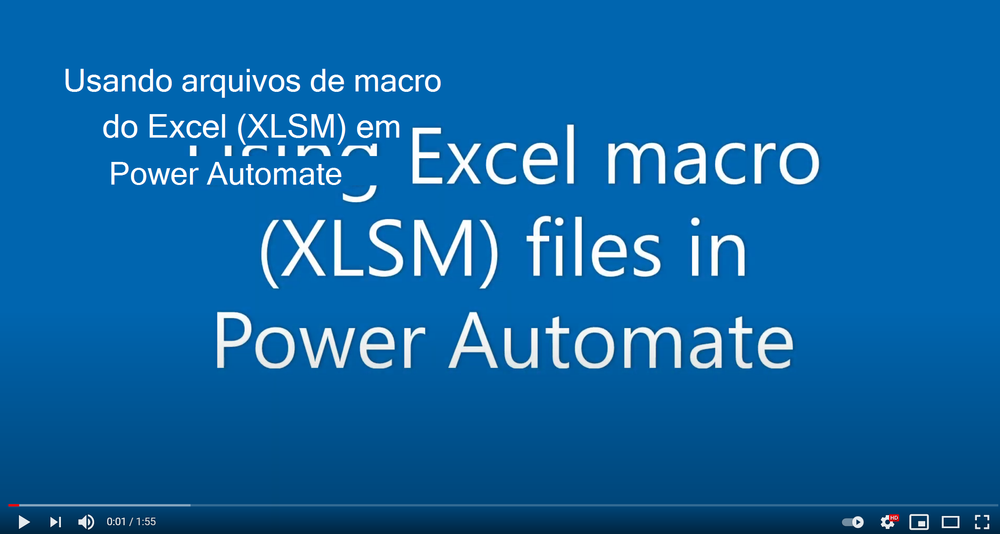

# Como usar arquivos de macro em fluxos do Power Automate

[Fluxos do Power Automate](https://flow.microsoft.com/) fornecem conectores do Excel para ajudar a conectar arquivos do Excel com o restante de seus dados e aplicativos organizacionais, como Teams, Outlook e SharePoint. 

No entanto, os arquivos de macro não podem ser selecionados no menu suspenso do arquivo (consulte um exemplo na captura de tela a seguir).

:::image type="content" source="../images/no-xlsm.png" alt-text="A ação de script Power Automate Run mostrando nenhum arquivo de macro selecionado. O erro mostrado é 'Arquivo' é necessário.":::

Uma maneira de se livrar desse problema é incluir a ação "Obter Metadados de Arquivo" (OneDrive ou SharePoint) e usar a propriedade ID na ação "Executar Script", conforme mostrado na captura de tela a seguir.

:::image type="content" source="../images/xlsm-in-pa.png" alt-text="A ação de script Executar do Power Automate mostrando o arquivo de macro selecionado e nenhum erro de script executar.":::

> [!NOTE]
> Alguns XLSM (especialmente aqueles com controles ActiveX/Formulário) podem não funcionar no conector online do Excel. Certifique-se de testar antes de implantar sua solução.

