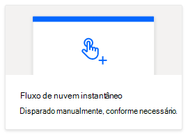
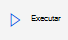

# <a name="call-scripts-from-a-manual-power-automate-flow-preview"></a><span data-ttu-id="d1305-103">Comece a usar scripts de um fluxo manual do Power Automate (pré-visualização)</span><span class="sxs-lookup"><span data-stu-id="d1305-103">Call scripts from a manual Power Automate flow (preview)</span></span>

<span data-ttu-id="d1305-104">Este tutorial ensina como executar um Script do Office para o Excel na web por meio do [Power Automate](https://flow.microsoft.com).</span><span class="sxs-lookup"><span data-stu-id="d1305-104">This tutorial teaches you how to run an Office Script for Excel on the web through [Power Automate](https://flow.microsoft.com).</span></span> <span data-ttu-id="d1305-105">Você fará um script que atualizará os valores de duas células com a hora atual.</span><span class="sxs-lookup"><span data-stu-id="d1305-105">You'll make a script that updates the values of two cells with the current time.</span></span> <span data-ttu-id="d1305-106">Depois, você fará a conexão desse script a um fluxo do Power Automate acionado manualmente, para que o script seja executado sempre que um botão no Power Automate for pressionado.</span><span class="sxs-lookup"><span data-stu-id="d1305-106">You'll then connect that script to a manually triggered Power Automate flow, so that the script is run whenever a button in Power Automate is pressed.</span></span> <span data-ttu-id="d1305-107">Depois de entender o padrão básico, você pode expandir o fluxo para incluir outros aplicativos e automatizar ainda mais o seu fluxo de trabalho diário.</span><span class="sxs-lookup"><span data-stu-id="d1305-107">Once you understand the basic pattern, you can expand the flow to include other applications and automate more of your daily workflow.</span></span>

> [!TIP]
> <span data-ttu-id="d1305-108">Se você não tiver experiência com os scripts do Office, recomendamos começar com o tutorial [Grave, edite e crie scripts do Office no Excel na Web](excel-tutorial.md).</span><span class="sxs-lookup"><span data-stu-id="d1305-108">If you are new to Office Scripts, we recommend starting with the [Record, edit, and create Office Scripts in Excel on the web](excel-tutorial.md) tutorial.</span></span> <span data-ttu-id="d1305-109">[Os Scripts do Office usam TypeScript](../overview/code-editor-environment.md) e este tutorial se destina a pessoas com conhecimento de nível iniciante a intermediário em JavaScript ou TypeScript.</span><span class="sxs-lookup"><span data-stu-id="d1305-109">[Office Scripts use TypeScript](../overview/code-editor-environment.md) and this tutorial is intended for people with beginner to intermediate-level knowledge of JavaScript or TypeScript.</span></span> <span data-ttu-id="d1305-110">Se você é novo no JavaScript, recomendamos começar com o [tutorial da Mozilla sobre JavaScript](https://developer.mozilla.org/docs/Web/JavaScript/Guide/Introduction).</span><span class="sxs-lookup"><span data-stu-id="d1305-110">If you're new to JavaScript, we recommend starting with the [Mozilla JavaScript tutorial](https://developer.mozilla.org/docs/Web/JavaScript/Guide/Introduction).</span></span>

## <a name="prerequisites"></a><span data-ttu-id="d1305-111">Pré-requisitos</span><span class="sxs-lookup"><span data-stu-id="d1305-111">Prerequisites</span></span>

[!INCLUDE [Tutorial prerequisites](../includes/power-automate-tutorial-prerequisites.md)]

## <a name="prepare-the-workbook"></a><span data-ttu-id="d1305-112">Preparar a pasta de trabalho</span><span class="sxs-lookup"><span data-stu-id="d1305-112">Prepare the workbook</span></span>

<span data-ttu-id="d1305-113">O Power Automate não pode usar[referências relativas](../testing/power-automate-troubleshooting.md#avoid-using-relative-references)como`Workbook.getActiveWorksheet`acessar componentes da pasta de trabalho.</span><span class="sxs-lookup"><span data-stu-id="d1305-113">Power Automate shouldn't use [relative references](../testing/power-automate-troubleshooting.md#avoid-using-relative-references) like `Workbook.getActiveWorksheet` to access workbook components.</span></span> <span data-ttu-id="d1305-114">Portanto, precisamos de uma pasta de trabalho e de uma planilha com nomes consistentes que o Power Automate consiga consultar.</span><span class="sxs-lookup"><span data-stu-id="d1305-114">So, we need a workbook and worksheet with consistent names that Power Automate can reference.</span></span>

1. <span data-ttu-id="d1305-115">Crie uma pasta de trabalho intitulada **MyWorkbook**.</span><span class="sxs-lookup"><span data-stu-id="d1305-115">Create a new workbook named **MyWorkbook**.</span></span>

2. <span data-ttu-id="d1305-116">Na pasta de trabalho **MyWorkbook**, crie uma planilha intitulada **TutorialWorksheet**.</span><span class="sxs-lookup"><span data-stu-id="d1305-116">In the **MyWorkbook** workbook, create a worksheet called **TutorialWorksheet**.</span></span>

## <a name="create-an-office-script"></a><span data-ttu-id="d1305-117">Criar um Script do Office</span><span class="sxs-lookup"><span data-stu-id="d1305-117">Create an Office Script</span></span>

1. <span data-ttu-id="d1305-118">Vá até a guia **Automatizar** e selecione **Todos os Scripts**.</span><span class="sxs-lookup"><span data-stu-id="d1305-118">Go to the **Automate** tab and select **All Scripts**.</span></span>

2. <span data-ttu-id="d1305-119">Selecione **Novo Script**.</span><span class="sxs-lookup"><span data-stu-id="d1305-119">Select **New Script**.</span></span>

3. <span data-ttu-id="d1305-120">Substitua o script padrão pelo script abaixo.</span><span class="sxs-lookup"><span data-stu-id="d1305-120">Replace the default script with the following script.</span></span> <span data-ttu-id="d1305-121">Esse script adiciona a data e hora atuais às duas primeiras células da planilha **TutorialWorksheet**.</span><span class="sxs-lookup"><span data-stu-id="d1305-121">This script adds the current date and time to the first two cells of the **TutorialWorksheet** worksheet.</span></span>

    ```TypeScript
    function main(workbook: ExcelScript.Workbook) {
      // Get the "TutorialWorksheet" worksheet from the workbook.
      let worksheet = workbook.getWorksheet("TutorialWorksheet");

      // Get the cells at A1 and B1.
      let dateRange = worksheet.getRange("A1");
      let timeRange = worksheet.getRange("B1");

      // Get the current date and time using the JavaScript Date object.
      let date = new Date(Date.now());

      // Add the date string to A1.
      dateRange.setValue(date.toLocaleDateString());

      // Add the time string to B1.
      timeRange.setValue(date.toLocaleTimeString());
    }
    ```

4. <span data-ttu-id="d1305-122">Renomeie o script como **Definir data e hora**.</span><span class="sxs-lookup"><span data-stu-id="d1305-122">Rename the script to **Set date and time**.</span></span> <span data-ttu-id="d1305-123">Pressione o nome do script para alterá-lo.</span><span class="sxs-lookup"><span data-stu-id="d1305-123">Press the script name to change it.</span></span>

5. <span data-ttu-id="d1305-124">Salve o script pressionando **Salvar Script**.</span><span class="sxs-lookup"><span data-stu-id="d1305-124">Save the script by pressing **Save Script**.</span></span>

## <a name="create-an-automated-workflow-with-power-automate"></a><span data-ttu-id="d1305-125">Criar um fluxo de trabalho automatizado com o Power Automate</span><span class="sxs-lookup"><span data-stu-id="d1305-125">Create an automated workflow with Power Automate</span></span>

1. <span data-ttu-id="d1305-126">Entre no [site do Power Automate](https://flow.microsoft.com).</span><span class="sxs-lookup"><span data-stu-id="d1305-126">Sign in to the [Power Automate site](https://flow.microsoft.com).</span></span>

2. <span data-ttu-id="d1305-127">No menu exibido do lado esquerdo da tela, pressione **Criar**.</span><span class="sxs-lookup"><span data-stu-id="d1305-127">In the menu that's displayed on the left side of the screen, press **Create**.</span></span> <span data-ttu-id="d1305-128">Isso o conduzirá a uma lista de maneiras de criar novos fluxos de trabalho.</span><span class="sxs-lookup"><span data-stu-id="d1305-128">This brings you to list of ways to create new workflows.</span></span>

    

3. <span data-ttu-id="d1305-130">Na seção **Começar no espaço em branco**, selecione **Fluxo instantâneo**.</span><span class="sxs-lookup"><span data-stu-id="d1305-130">In the **Start from blank** section, select **Instant flow**.</span></span> <span data-ttu-id="d1305-131">Isso irá criar um fluxo de trabalho ativado manualmente.</span><span class="sxs-lookup"><span data-stu-id="d1305-131">This creates a manually activated workflow.</span></span>

    

4. <span data-ttu-id="d1305-133">Na janela da caixa de diálogo que aparece, insira um nome para o seu fluxo na caixa de texto **Nome do fluxo**; selecione **Acionar um fluxo manualmente** na lista de opções em **Escolher como acionar o fluxo**, e pressione **Criar**.</span><span class="sxs-lookup"><span data-stu-id="d1305-133">In the dialog window that appears, enter a name for your flow in the **Flow name** text box, select **Manually trigger a flow** from the list of options under **Choose how to trigger the flow**, and press **Create**.</span></span>

    

    <span data-ttu-id="d1305-135">Observe que o fluxo acionado manualmente é apenas um entre os diversos tipos de fluxo.</span><span class="sxs-lookup"><span data-stu-id="d1305-135">Note that a manually triggered flow is just one of many types of flows.</span></span> <span data-ttu-id="d1305-136">No tutorial a seguir, você criará um fluxo que é executado automaticamente quando você recebe um email.</span><span class="sxs-lookup"><span data-stu-id="d1305-136">In the next tutorial, you'll make a flow that automatically runs when you receive an email.</span></span>

5. <span data-ttu-id="d1305-137">Pressione **Nova etapa**.</span><span class="sxs-lookup"><span data-stu-id="d1305-137">Press **New step**.</span></span>

6. <span data-ttu-id="d1305-138">Selecione a guia **Padrão** e, em seguida, selecione **Excel Online (Business)**.</span><span class="sxs-lookup"><span data-stu-id="d1305-138">Select the **Standard** tab, then select **Excel Online (Business)**.</span></span>

    

7. <span data-ttu-id="d1305-140">Em **Ações**, selecione **executar script (visualização)**.</span><span class="sxs-lookup"><span data-stu-id="d1305-140">Under **Actions**, select **Run script (preview)**.</span></span>

    

8. <span data-ttu-id="d1305-142">Depois, você selecionará a pasta de trabalho e o script que será utilizado na etapa do fluxo.</span><span class="sxs-lookup"><span data-stu-id="d1305-142">Next, you'll select the workbook and script to use in the flow step.</span></span> <span data-ttu-id="d1305-143">Para o tutorial, você fará o uso da pasta de trabalho criada no seu OneDrive, mas é possível usar qualquer pasta de trabalho em um site OneDrive ou no Microsoft Office SharePoint Online.</span><span class="sxs-lookup"><span data-stu-id="d1305-143">For the tutorial, you'll use the workbook you created in your OneDrive, but you could use any workbook in a OneDrive or SharePoint site.</span></span> <span data-ttu-id="d1305-144">Especifique as seguintes configurações para o conector **Executar Script**:</span><span class="sxs-lookup"><span data-stu-id="d1305-144">Specify the following settings for the **Run script** connector:</span></span>

    - <span data-ttu-id="d1305-145">**Localização**: OneDrive for Business</span><span class="sxs-lookup"><span data-stu-id="d1305-145">**Location**: OneDrive for Business</span></span>
    - <span data-ttu-id="d1305-146">**Biblioteca de Documentos**: OneDrive</span><span class="sxs-lookup"><span data-stu-id="d1305-146">**Document Library**: OneDrive</span></span>
    - <span data-ttu-id="d1305-147">**Arquivo**: MyWorkbook.xlsx *(Escolhido por meio do navegador de arquivos)*</span><span class="sxs-lookup"><span data-stu-id="d1305-147">**File**: MyWorkbook.xlsx *(Chosen through the file browser)*</span></span>
    - <span data-ttu-id="d1305-148">**Script**: Definir data e hora</span><span class="sxs-lookup"><span data-stu-id="d1305-148">**Script**: Set date and time</span></span>

    

9. <span data-ttu-id="d1305-150">Pressione **Salvar**.</span><span class="sxs-lookup"><span data-stu-id="d1305-150">Press **Save**.</span></span>

<span data-ttu-id="d1305-151">Seu fluxo agora está pronto para ser executado por meio do Power Automate.</span><span class="sxs-lookup"><span data-stu-id="d1305-151">Your flow is now ready to be run through Power Automate.</span></span> <span data-ttu-id="d1305-152">Você pode testá-lo usando o botão **Testar** no editor de fluxo ou seguir as etapas restantes do tutorial para executar o fluxo a partir da sua coleção de fluxos.</span><span class="sxs-lookup"><span data-stu-id="d1305-152">You can test it using the **Test** button in the flow editor or follow the remaining tutorial steps to run the flow from your flow collection.</span></span>

## <a name="run-the-script-through-power-automate"></a><span data-ttu-id="d1305-153">Executar o script por meio da automação</span><span class="sxs-lookup"><span data-stu-id="d1305-153">Run the script through Power Automate</span></span>

1. <span data-ttu-id="d1305-154">Na página principal do Power Automate, selecione **Meus fluxos**.</span><span class="sxs-lookup"><span data-stu-id="d1305-154">From the main Power Automate page, select **My flows**.</span></span>

    

2. <span data-ttu-id="d1305-156">Selecione **Fluxo do meu tutorial** na lista de fluxos exibida na guia **Meus fluxos**. Isso irá lhe mostrar os detalhes do fluxo que criamos anteriormente.</span><span class="sxs-lookup"><span data-stu-id="d1305-156">Select **My tutorial flow** from the list of flows displayed in the **My flows** tab. This shows the details of the flow we previously created.</span></span>

3. <span data-ttu-id="d1305-157">Pressione **Executar**.</span><span class="sxs-lookup"><span data-stu-id="d1305-157">Press **Run**.</span></span>

    

4. <span data-ttu-id="d1305-159">Um painel de tarefas irá aparecer para executar o fluxo.</span><span class="sxs-lookup"><span data-stu-id="d1305-159">A task pane will appear for running the flow.</span></span> <span data-ttu-id="d1305-160">Se você for solicitado a **Entrar** no Excel Online, faça o login pressionando **Continuar**.</span><span class="sxs-lookup"><span data-stu-id="d1305-160">If you are asked to **Sign in** to Excel Online, do so by pressing **Continue**.</span></span>

5. <span data-ttu-id="d1305-161">Pressione **Executar o fluxo**.</span><span class="sxs-lookup"><span data-stu-id="d1305-161">Press **Run flow**.</span></span> <span data-ttu-id="d1305-162">Isso executará o fluxo, que, por sua vez, executará o Script do Office associado.</span><span class="sxs-lookup"><span data-stu-id="d1305-162">This runs the flow, which runs the related Office Script.</span></span>

6. <span data-ttu-id="d1305-163">Pressione **Concluído**.</span><span class="sxs-lookup"><span data-stu-id="d1305-163">Press **Done**.</span></span> <span data-ttu-id="d1305-164">Você deverá ver a seção **Executar** ser atualizada de acordo.</span><span class="sxs-lookup"><span data-stu-id="d1305-164">You should see the **Runs** section update accordingly.</span></span>

7. <span data-ttu-id="d1305-165">Atualize a página para ver os resultados do Power Automate.</span><span class="sxs-lookup"><span data-stu-id="d1305-165">Refresh the page to see the results of the Power Automate.</span></span> <span data-ttu-id="d1305-166">Se o script tiver sido bem-sucedido, vá para a pasta de trabalho para ver as células atualizadas.</span><span class="sxs-lookup"><span data-stu-id="d1305-166">If it succeeded, go to the workbook to see the updated cells.</span></span> <span data-ttu-id="d1305-167">Se tiver falhado, verifique as configurações do fluxo e execute-o novamente.</span><span class="sxs-lookup"><span data-stu-id="d1305-167">If it failed, verify the flow's settings and run it a second time.</span></span>

    

## <a name="next-steps"></a><span data-ttu-id="d1305-169">Próximas etapas</span><span class="sxs-lookup"><span data-stu-id="d1305-169">Next steps</span></span>

<span data-ttu-id="d1305-170">Faça o tutorial [Transferir dados para scripts em um fluxo executado automaticamente pelo Power Automate](excel-power-automate-trigger.md).</span><span class="sxs-lookup"><span data-stu-id="d1305-170">Complete the [Pass data to scripts in an automatically-run Power Automate flow](excel-power-automate-trigger.md) tutorial.</span></span> <span data-ttu-id="d1305-171">O tutorial ensinará como transferir dados de um serviço de fluxo de trabalho para o seu Script do Office e executar o fluxo do Power Automate quando certos eventos ocorrerem.</span><span class="sxs-lookup"><span data-stu-id="d1305-171">It teaches you how to pass data from a workflow service to your Office Script and run the Power Automate flow when certain events occur.</span></span>
