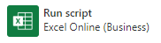

# <a name="return-data-from-a-script-to-an-automatically-run-power-automate-flow-preview"></a>Retorna dados de um script para um fluxo do Power Automate executado automaticamente (visualização)

Este tutorial ensina como retornar informações de um Script do Office para o Excel na web como parte de um fluxo de trabalho automatizado do [Power Automate](https://flow.microsoft.com). Você fará um script que olha através de uma programação e trabalha com um fluxo para enviar emails de lembrete. Esse fluxo será executado em uma programação regular, fornecendo esses lembretes em seu nome.

> [!TIP]
> Se você não tiver experiência com os scripts do Office, recomendamos começar com o tutorial [Grave, edite e crie scripts do Office no Excel na Web](excel-tutorial.md).
>
> Se você é novo no Power Automate, recomendamos começar com os tutoriais [ Chamada de scripts de um fluxo manual do Power Automate](excel-power-automate-manual.md) e [Passar dados para scripts em um fluxo automático do Power Automate](excel-power-automate-trigger.md).
>
> [Os Scripts do Office usam TypeScript](../overview/code-editor-environment.md) e este tutorial se destina a pessoas com conhecimento de nível iniciante a intermediário em JavaScript ou TypeScript. Se você é novo no JavaScript, recomendamos começar com o [tutorial da Mozilla sobre JavaScript](https://developer.mozilla.org/docs/Web/JavaScript/Guide/Introduction).

## <a name="prerequisites"></a>Pré-requisitos

[!INCLUDE [Tutorial prerequisites](../includes/power-automate-tutorial-prerequisites.md)]

## <a name="prepare-the-workbook"></a>Preparar a pasta de trabalho

1. Baixe a pasta de trabalho <a href="on-call-rotation.xlsx">on-call-rotation.xlsx</a> para o seu OneDrive.

1. Abra **on-call-rotation.xlsx** no Excel na web.

1. Adicione uma linha à tabela com seu nome, endereço de email e datas de início e fim que coincidam com a data atual.

    > [!IMPORTANT]
    > O roteiro que você vai escrever utiliza a primeira entrada correspondente na tabela, portanto, certifique-se de que seu nome esteja acima de qualquer linha com a semana atual.

    

## <a name="create-an-office-script"></a>Crie um Script do Office

1. Vá até a guia **Automatizar** e selecione **Todos os Scripts**.

1. Selecione **Novo Script**.

1. Nomeie o script **Obter uma Pessoa de Plantão**.

1. Agora você deve ter um script vazio. Queremos usar o roteiro para obter um endereço de email da planilha. Altere `main` para retornar uma cadeia de caracteres, como esta:

    ```typescript
    function main(workbook: ExcelScript.Workbook) : string {
    }
    ```

1. Em seguida, precisamos obter todos os dados da tabela. Isso nos permite examinar cada linha com o script. Adicione o seguinte código dentro da função `main`.

    ```typescript
    // Get the H1 worksheet.
    let worksheet = workbook.getWorksheet("H1");

    // Get the first (and only) table in the worksheet.
    let table = worksheet.getTables()[0];

    // Get the data from the table.
    let tableValues = table.getRangeBetweenHeaderAndTotal().getValues();
    ```

1. As datas na tabela são armazenadas usando o [Número de série da data do Excel ](https://support.microsoft.com/office/date-systems-in-excel-e7fe7167-48a9-4b96-bb53-5612a800b487). Precisamos converter essas datas para datas JavaScript a fim de compará-las. Adicionaremos uma função auxiliar ao nosso script. Adicione o seguinte código fora da função `main`:

    ```typescript
    // Convert the Excel date to a JavaScript Date object.
    function convertDate(excelDateValue: number) {
        let javaScriptDate = new Date(Math.round((excelDateValue - 25569) * 86400 * 1000));
        return javaScriptDate;
    }
    ```

1. Agora, precisamos descobrir qual pessoa está de plantão agora. A linha deles terá uma data de início e de término em torno da data atual. Escreveremos um script para assumir que apenas uma pessoa está de plantão por vez. Os scripts podem retornar matrizes para lidar com múltiplos valores, mas por enquanto retornaremos o primeiro endereço de email correspondente. Adicione o seguinte código ao final da função `main`.

    ```typescript
    // Look for the first row where today's date is between the row's start and end dates.
    let currentDate = new Date();
    for (let row = 0; row < tableValues.length; row++) {
        let startDate = convertDate(tableValues[row][2] as number);
        let endDate = convertDate(tableValues[row][3] as number);
        if (startDate <= currentDate && endDate >= currentDate) {
            // Return the first matching email address.
            return tableValues[row][1].toString();
        }
    }
    ```

1. O script final deve ser semelhante a este:

    ```typescript
    function main(workbook: ExcelScript.Workbook) : string {
        // Get the H1 worksheet.
        let worksheet = workbook.getWorksheet("H1");

        // Get the first (and only) table in the worksheet.
        let table = worksheet.getTables()[0];
    
        // Get the data from the table.
        let tableValues = table.getRangeBetweenHeaderAndTotal().getValues();
    
        // Look for the first row where today's date is between the row's start and end dates.
        let currentDate = new Date();
        for (let row = 0; row < tableValues.length; row++) {
            let startDate = convertDate(tableValues[row][2] as number);
            let endDate = convertDate(tableValues[row][3] as number);
            if (startDate <= currentDate && endDate >= currentDate) {
                // Return the first matching email address.
                return tableValues[row][1].toString();
            }
        }
    }

    // Convert the Excel date to a JavaScript Date object.
    function convertDate(excelDateValue: number) {
        let javaScriptDate = new Date(Math.round((excelDateValue - 25569) * 86400 * 1000));
        return javaScriptDate;
    }
    ```

## <a name="create-an-automated-workflow-with-power-automate"></a>Criar um fluxo de trabalho automatizado com o Power Automate

1. Entre no [site do Power Automate](https://flow.microsoft.com).

1. No menu exibido do lado esquerdo da tela, pressione **Criar**. Isso o conduzirá a uma lista de maneiras de criar novos fluxos de trabalho.

    

1. Na seção **Iniciar com um Modelo em Branco**, selecione **Fluxo de nuvem agendado**.

    

1. Agora precisamos definir o cronograma para esse fluxo. Nossa planilha tem uma nova atribuição de plantão começando toda segunda-feira no primeiro semestre de 2021. Vamos definir o fluxo para começar nas manhãs de segunda-feira. Use as seguintes opções para configurar o fluxo a ser executado na segunda-feira de cada semana.

    - **Nome do fluxo**: Notificar a Pessoa de Plantão
    - **Iniciando em**: 4/1/21 à 1h00
    - **Repetir a cada**: 1 Semana
    - **Nesses dias**: M

    

1. Pressione **Criar**.

1. Pressione **Nova etapa**.

1. Selecione a guia **Padrão** e, em seguida, selecione **Excel Online (Business)**.

    

1. Em **Ações**, selecione **executar script (visualização)**.

    

1. Em seguida, você selecionará a pasta de trabalho e o script que será utilizado na etapa do fluxo. Use a pasta de trabalho **on-call-rotation.xlsx** que você criou em seu OneDrive. Especifique as seguintes configurações para o conector **Executar Script**:

    - **Localização**: OneDrive for Business
    - **Biblioteca de Documentos**: OneDrive
    - **Arquivo**: on-call-rotation.xlsx *(Escolhido através do navegador de arquivos)*
    - **Script**: Obter uma Pessoa de Plantão

    

1. Pressione **Nova etapa**.

1. Terminaremos o fluxo enviando o email de lembrete. Selecione **Enviar um email (V2)** usando a barra de pesquisa do conector. Use o controle **Adicionar conteúdo dinâmico** para adicionar o endereço de email retornado pelo script. Ele será rotulado como **resultado** com o ícone do Excel próximo a ele. Você pode fornecer qualquer assunto e corpo de texto que desejar.

    

    > [!NOTE]
    > Este tutorial usa o Outlook. Sinta-se à vontade para usar o seu serviço de email preferido, embora algumas opções possam ser diferentes.

1. Pressione **Salvar**.

## <a name="test-the-script-in-power-automate"></a>Teste o script no Power Automate

Seu fluxo funcionará todas as segundas-feiras de manhã. Você pode testar o script agora pressionando o botão **Testar** no canto superior direito da tela. Selecione **Manualmente** e pressione **Executar Teste** para executar o fluxo agora e testar o comportamento. Pode ser necessário conceder permissões ao Excel e Outlook para continuar.


> [!TIP]
> Se o seu fluxo não enviar um email, verifique na planilha se um email válido está listado para o intervalo de datas atual na parte superior da tabela.

## <a name="next-steps"></a>Próximas etapas

Visite [executar os Scripts do Office com o Power Automate](../develop/power-automate-integration.md) para saber mais sobre como conectar Scripts do Office com o Power Automate.

Você também pode conferir o exemplo de [lembretes automáticos de tarefas](../resources/scenarios/task-reminders.md) para aprender a combinar os Scripts do Office e Power Automate com as placas adaptáveis de equipes.
